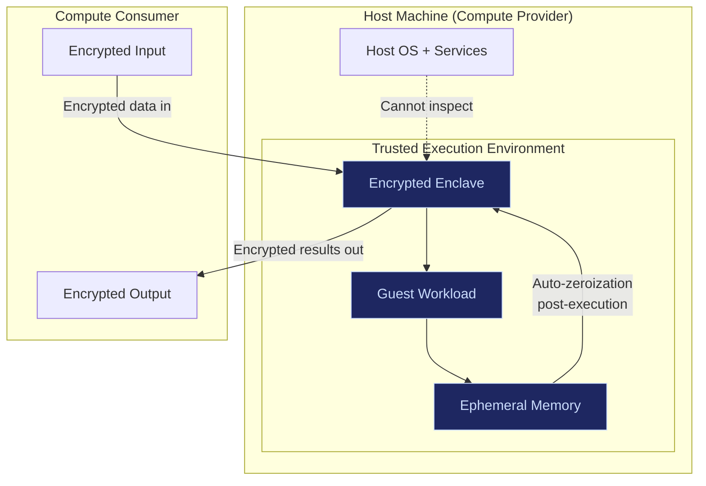
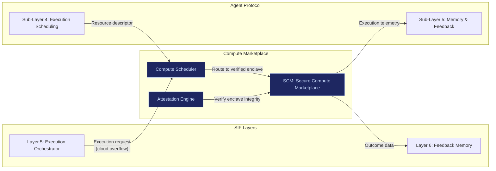

# Compute Marketplace

The Secure Compute Marketplace (SCM) enables enterprises to monetize idle compute capacity through enclave-based encrypted leasing. This is not consumer GPU mining. This is enterprise-to-enterprise confidential compute sharing — with hardware-rooted isolation, cryptographic attestation, and zero data visibility for the host.

---

## The Thesis

Modern enterprise GPU infrastructure sits idle at night. Enterprise clusters run AI workloads during business hours and produce nothing during off-hours. Meanwhile, other enterprises need burst compute for inference, training, or simulation.

The analogy is Uber for compute: idle capacity is routed to verified demand. But compute is fundamentally different from cars — data can leak, models can be copied, memory can be scraped. So compute-sharing is a **trust problem**, not a logistics problem.

| Attribute | Cars (Uber) | Compute (SCM) |
|---|---|---|
| Asset | Physical vehicle | GPU/NPU/CPU cycles |
| During ride/job | Cannot duplicate the car | Data can potentially leak |
| Trust model | Driver + platform reputation | Hardware attestation + enclave isolation |
| Core risk | Physical safety | Information leakage |
| Scaling advantage | Easy once stable | Even easier — no physical logistics |

---

## Enclave Architecture

Every compute lease executes inside a **Trusted Execution Environment (TEE)** — a sealed box inside the host machine. The host cannot see the guest workload. The guest cannot see the host filesystem.

### Security Properties

| Property | Implementation |
|---|---|
| **Hardware-rooted isolation** | TEE (Intel SGX, AMD SEV, ARM TrustZone or equivalent) |
| **Memory isolation** | Guest workload memory encrypted; host OS cannot read |
| **Zero data visibility** | Host never sees plaintext input, output, or intermediate state |
| **Remote attestation** | Consumer cryptographically verifies enclave integrity before sending data |
| **Ephemeral memory** | All memory auto-zeroized post-execution |
| **Verified workload** | Code hash verified before execution begins |
| **Fixed resource caps** | CPU/GPU/RAM/time budgets enforced at hardware level |

### What the Host Cannot Do

- Cannot inspect workload input
- Cannot inspect workload output
- Cannot read enclave memory during execution
- Cannot modify workload code after attestation
- Cannot persist any data after execution completes

### What the Consumer Must Prove

- Workload code matches declared hash
- Execution request is cryptographically signed
- Resource requirements are within declared bounds
- Data is encrypted with ephemeral keys

---

## Economic Model

### Revenue Per Node

| Metric | Value |
|---|---|
| **Monthly shared revenue** | ~$2,000 per node |
| **Revenue split** | Enterprise (host) keeps 70%, FrankMax keeps 30% |
| **FrankMax revenue per node** | ~$600/month |
| **Annual FrankMax revenue per node** | ~$7,200 |
| **Host annual revenue per node** | ~$16,800 |

### Scaling Economics

| Deployed Nodes | Annual FrankMax Revenue (Compute Mesh) | Annual Host Revenue (Total) |
|---|---|---|
| 10 | $72,000 | $168,000 |
| 50 | $360,000 | $840,000 |
| 100 | $720,000 | $1,680,000 |

### Combined Revenue (Node Subscription + Compute Leasing)

At 50 enterprise customers, each running one sovereign node:

| Revenue Stream | Annual Revenue |
|---|---|
| Node subscriptions (50 x $48,000) | $2,400,000 |
| Compute mesh revenue (50 x $7,200) | $360,000 |
| **Total** | **$2,760,000** |

### What Makes Compute Leasing Work Economically

| Factor | Detail |
|---|---|
| **Idle capacity** | Enterprise GPUs idle overnight (8-12 hours/day), weekends, holidays |
| **Zero marginal cost for host** | Hardware is already purchased and powered; incremental cost is electricity |
| **Enterprise-grade workloads** | Verified, auditable workloads — not random consumer tasks |
| **Trust premium** | Enterprises pay more for attestation-verified confidential compute than commodity cloud |
| **Recurring passive revenue** | Hosts earn $16,800/year per node for capacity they already own |

---

## What SCM Is NOT

| Not this | Explanation |
|---|---|
| **Consumer GPU mining** | No random home laptops. Enterprise clusters only. |
| **Token-based incentives** | No speculation. Usage-based compensation tied to verified workload. |
| **Centralized scheduler monopoly** | Multiple coordinators can route compute. No single authority. |
| **Data marketplace** | SCM sells compute cycles, not data. Host never sees workload data. |
| **Dynamic pricing casino** | Fixed resource caps, predictable pricing, no surge mechanics. |

---

## Integration with SIF Architecture

SCM connects to the broader SIF architecture at multiple points:

### How It Fits the Edge-First Model

| Execution priority | When SCM activates |
|---|---|
| 1. Local device (edge) | SCM not needed — workload runs on user's own hardware |
| 2. SCM (peer compute) | Local resources insufficient; nearby enterprise node has idle capacity |
| 3. Cloud overflow | No peer compute available or workload exceeds edge network capacity |

SCM is **priority 2** in the execution chain — after local edge but before traditional cloud. This creates a middle layer of confidential, decentralized compute that reduces cloud dependency without requiring every user to own sufficient hardware.

---

## Operational Requirements

### For Compute Hosts (Providers)

| Requirement | Detail |
|---|---|
| TEE-capable hardware | Intel SGX, AMD SEV, or equivalent |
| Minimum idle capacity | 8GB RAM + 1 GPU available during lease windows |
| Network connectivity | Stable connection for remote attestation and data transfer |
| SIF node running | Edge Sovereign Runtime (ESR) deployed and operational |
| Audit compliance | Execution logs retained per retention policy |

### For Compute Consumers (Renters)

| Requirement | Detail |
|---|---|
| Verified identity | Sovereign Identity Primitive (SIP) with attestation |
| Signed workload | Code hash declared and cryptographically signed |
| Encrypted data | All input/output encrypted with ephemeral keys |
| Resource declaration | CPU/GPU/RAM/time requirements declared upfront |
| Payment | Pre-authorized based on resource reservation |

---

## Trust Architecture

Compute sharing without trust is a liability. SCM enforces trust at four levels:

| Level | Mechanism |
|---|---|
| **Hardware** | TEE attestation proves enclave integrity before any data enters |
| **Software** | Workload code hash verified against declaration — no runtime modification |
| **Network** | All data in transit encrypted; ephemeral session keys; no persistent connections |
| **Economic** | Usage-based compensation; no token speculation; verified workload accounting |

### What Cannot Be Prevented

- If a TEE has a hardware vulnerability (rare but possible), side-channel attacks may extract information.
- Physical access to the host machine may enable advanced attacks.
- Nation-state level adversaries may compromise hardware supply chains.

**Design principle**: SCM is high-friction to compromise, minimal attack surface, self-contained, and recoverable. Security = risk minimization, not immortality.

---

## Rollout Sequence

| Phase | What ships | Timeframe |
|---|---|---|
| **Phase 0** | Enterprise sovereign nodes deployed (ESR) — no compute sharing | Year 1 |
| **Phase 1** | Internal compute sharing between nodes within same enterprise | Year 2 |
| **Phase 2** | Cross-enterprise compute leasing between verified SIF network members | Year 2-3 |
| **Phase 3** | Open compute marketplace with attestation-based trust | Year 3+ |

Compute leasing is not a launch feature. It is an expansion feature that activates after the installed base of sovereign nodes creates sufficient idle capacity to make a marketplace viable.
