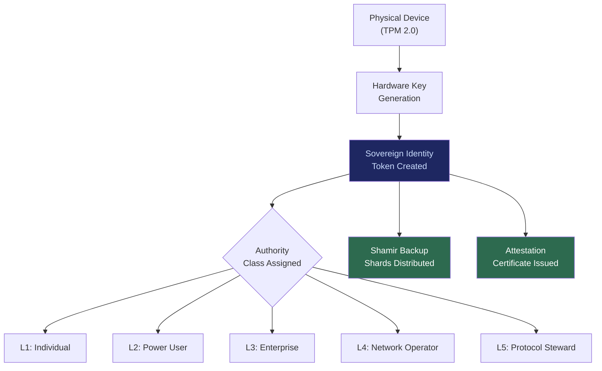

# SIP: Sovereign Identity Primitive

## What It Is

A hardware-rooted, post-quantum cryptographic identity system bound to physical persons and their devices. SIP eliminates passwords, cookies, trackers, and centralized identity providers by anchoring identity to tamper-resistant hardware (TPM 2.0, secure enclaves) and algorithm-agile cryptographic primitives.

SIP is the **irreducible foundation** of the Sovereign Intent Fabric. Without it, every other deliverable inherits the fragility of legacy identity systems. With it, every action, delegation, and data access is cryptographically traceable to a sovereign entity.

---

## Purpose and Problem It Solves

| Problem | Current State | SIP Resolution |
|---|---|---|
| Password-based authentication | 80% of breaches involve stolen credentials | Hardware-bound keypairs eliminate shared secrets |
| Centralized identity providers | OAuth/SAML depend on Google, Microsoft, Apple trust anchors | Self-sovereign identity anchored to user-owned hardware |
| Cookie/tracker surveillance | Cross-site tracking as business model | Zero tracking surface; identity is local-first |
| SIM-based identity | SIM-swap attacks compromise 2FA | TPM-bound keys are non-extractable |
| Post-quantum vulnerability | RSA/ECC keys breakable by future quantum computers | Algorithm-agile design; swappable to CRYSTALS-Kyber, CRYSTALS-Dilithium, SPHINCS+ |
| Device loss recovery | Single device = single point of failure | Shamir Secret Sharing for backup key distribution |

---

## Technical Specification

### Inputs

| Input | Description |
|---|---|
| TPM 2.0 attestation | Hardware root of trust from device |
| Biometric binding (optional) | Fingerprint/face to prevent unauthorized device use |
| Recovery shard set | Shamir-split backup keys stored across N trusted locations |
| Algorithm selection | Post-quantum algorithm suite from PQCS |

### Outputs

| Output | Description |
|---|---|
| Sovereign Identity Token | Cryptographic proof of identity bound to hardware + person |
| Scoped Authority Classes | Time-bound privilege tiers (L1-L5) |
| Attestation Certificate | Verifiable proof that identity was generated on compliant hardware |
| Key Rotation Schedule | Automatic re-keying without identity disruption |

### Key Interfaces

```
SIP.createIdentity(tpmAttestation, algorithmSuite) → SovereignIdentityToken
SIP.elevatePrivilege(identityToken, scope, duration) → ScopedAuthorityGrant
SIP.rotateKeys(identityToken, newAlgorithm) → UpdatedIdentityToken
SIP.recoverIdentity(shardSet, quorum) → RecoveredIdentityToken
SIP.revokeIdentity(identityToken, reason) → RevocationCertificate
```

---

## Architecture



---

## Integration Points

| Component | Integration |
|---|---|
| **ESR** (Edge Sovereignty Runtime) | SIP identity required to boot and authenticate edge runtime |
| **PFV** (Personal Fabric Vault) | Vault encryption keys derived from SIP identity |
| **SACS** (Sovereign Agent Coordination System) | Agent contracts cryptographically signed by SIP identity |
| **PQCS** (Post-Quantum Cryptographic Suite) | SIP consumes algorithm primitives from PQCS |
| **CE** (Compliance Engine) | Authority decay timers enforced on SIP privilege elevations |
| **ORF** (Obligation & Responsibility Finality) | SIP provides the cryptographic binding required for ETLB responsibility assignment |
| **ETLB** (Execution-Time Liability Binding) | Natural person bound via SIP token at execution time |
| **MCO** (Mortality Compliance Object) | SIP identities have enforced expiry; no immortal authority grants |

---

## Implementation Priority

**Phase 1 — Years 0-1 (Survive & Prove)**

SIP is the **first deliverable shipped**. It is part of the non-negotiable nucleus: `SIP + ESR + SACS + CE`.

- Month 1-3: TPM-backed identity generation on production sovereign node
- Month 3-6: Enterprise-bound identity schema for first law firm deployments
- Month 6-12: Key rotation, Shamir recovery, and authority class enforcement

---

## Constraints

- Authority must decay by default. No identity is permanently omnipotent.
- Privilege elevation requires re-ratification and is time-bound.
- All privilege changes are logged and contestable.
- Recovery requires minimum quorum of Shamir shards; no single-point recovery.

---

## User Level Access

| Level | Profile | SIP Capability |
|---|---|---|
| L1 | Everyday Individual | Basic sovereign identity, single device |
| L2 | Power User / Builder | Multi-device identity federation |
| L3 | Enterprise Node | Organizational identity hierarchy |
| L4 | Network Operator | Cross-organization identity attestation |
| L5 | Protocol Steward | Identity schema governance (decaying authority) |

---

## Related Deliverables

- [ESR — Edge Sovereignty Runtime](./02-esr)
- [PFV — Personal Fabric Vault](./03-pfv)
- [PQCS — Post-Quantum Cryptographic Suite](./11-pqcs)
- [CE — Compliance Engine](./15-ce)
- [SACS — Sovereign Agent Coordination System](./05-sacs)
