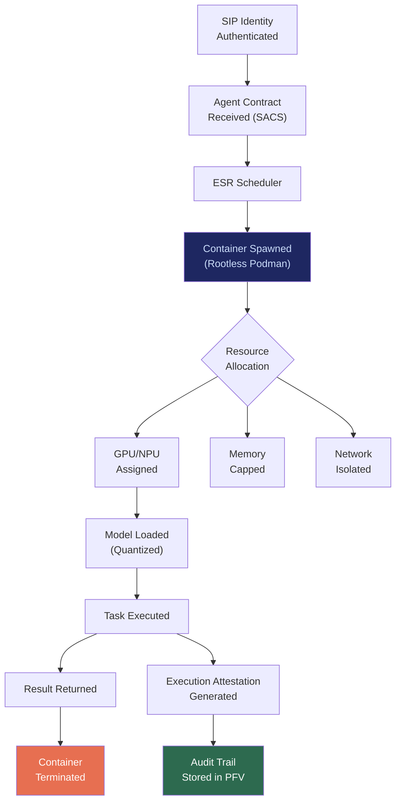

# ESR: Edge Sovereignty Runtime

## What It Is

A local agent execution engine that runs containerized AI workloads directly on user-owned hardware with scoped cryptographic contracts, zero telemetry, and no cloud dependency. ESR treats agents as ephemeral processes — spun up on demand, resource-constrained, and killed after task completion.

ESR is the **compute primitive** of the Sovereign Intent Fabric. It proves the core thesis: compute moves to data, not data to cloud.

---

## Purpose and Problem It Solves

| Problem | Current State | ESR Resolution |
|---|---|---|
| Cloud dependency for AI inference | All major LLM providers require data egress | Local inference on user hardware; no data leaves premises |
| Idle edge compute wasted | Laptops, workstations, phones sit 80%+ idle | Containerized agent scheduling maximizes local compute yield |
| Agent authority creep | Cloud agents accumulate persistent access | Ephemeral containers with cryptographic execution boundaries |
| Unnecessary OS services consuming compute | Desktop Linux runs 100+ daemons | Minimal kernel + container runtime; no bloat |
| No NPU utilization | Edge NPUs (Apple Neural Engine, Qualcomm Hexagon) underutilized | NPU-aware scheduling for inference acceleration |

---

## Technical Specification

### Inputs

| Input | Description |
|---|---|
| SIP identity token | Authenticated sovereign identity of the device/user |
| Agent contract (from SACS) | Cryptographic capability descriptor defining scope, duration, resources |
| Model artifact | Quantized model binary (ONNX, GGUF, safetensors) |
| Task intent | Structured intent declaration from IDE or IOO |

### Outputs

| Output | Description |
|---|---|
| Execution attestation | Cryptographic proof of what ran, for how long, with what data access |
| Task result | Output of agent computation |
| Resource consumption log | CPU/GPU/NPU/memory/network usage per container |
| Audit trail | Immutable record for compliance verification |

### Key Interfaces

```
ESR.spawnAgent(contract, model, intent) → ContainerID
ESR.terminateAgent(containerID) → ExecutionAttestation
ESR.getResourceUsage(containerID) → ResourceMetrics
ESR.listActiveAgents() → AgentManifest[]
ESR.enforceConstraints(containerID, limits) → ConstraintAck
```

### Runtime Stack

| Layer | Implementation |
|---|---|
| Container engine | Rootless Podman (no daemon, no root) |
| Orchestration | Lightweight scheduler (not full Kubernetes for edge) |
| Model runtime | Ollama / llama.cpp / vLLM |
| Isolation | Network namespace isolation, read-only filesystem, memory caps |
| Scheduling | GPU-first with NPU fallback, cold-start minimization |

---

## Architecture



---

## Integration Points

| Component | Integration |
|---|---|
| **SIP** | Device identity required to boot ESR; all containers run under authenticated identity |
| **SACS** | Agent contracts define execution boundaries; ESR enforces them |
| **PFV** | Execution attestations and audit trails stored in encrypted vault |
| **IOO** (Intent Outcome Oracle) | Receives execution results for feedback loop |
| **CE** (Compliance Engine) | Time-bound authority decay enforced on long-running agents |
| **SCM** (Sovereign Compute Marketplace) | ESR nodes can optionally lease idle compute via SCM |
| **EDCS** (Edge Data Classification System) | Hardware certification validates ESR node compliance |
| **ORF** | Every agent execution creates an obligation tracked through ORF lifecycle |
| **ETLB** | Liability for agent output bound to SIP identity at execution time |

---

## Implementation Priority

**Phase 1 — Years 0-1 (Survive & Prove)**

ESR is part of the non-negotiable nucleus: `SIP + ESR + SACS + CE`.

- Month 1-3: Rootless Podman + Ollama on production sovereign node
- Month 3-6: Scoped container isolation (no host access, no default network)
- Month 6-12: NPU-aware scheduling, execution attestation generation
- First deployment: Secure Legal AI Node for mid-sized law firms

---

## Constraints

- No container runs as root.
- No container has host filesystem access unless explicitly mounted per contract.
- Network access must be explicitly declared in agent contract.
- All containers are ephemeral; no persistent state outside PFV.
- Resource limits (CPU, GPU, memory, time) are hard caps, not soft suggestions.

---

## User Level Access

| Level | Profile | ESR Capability |
|---|---|---|
| L1 | Everyday Individual | Not enabled (cloud fallback) |
| L2 | Power User / Builder | Local agent execution, single device |
| L3 | Enterprise Node | Multi-node scheduling, GPU clusters |
| L4 | Network Operator | Cross-organization compute federation |
| L5 | Protocol Steward | Runtime specification governance |

---

## Related Deliverables

- [SIP — Sovereign Identity Primitive](./01-sip)
- [SACS — Sovereign Agent Coordination System](./05-sacs)
- [PFV — Personal Fabric Vault](./03-pfv)
- [SCM — Sovereign Compute Marketplace](./10-scm)
- [EDCS — Edge Data Classification System](./16-edcs)
