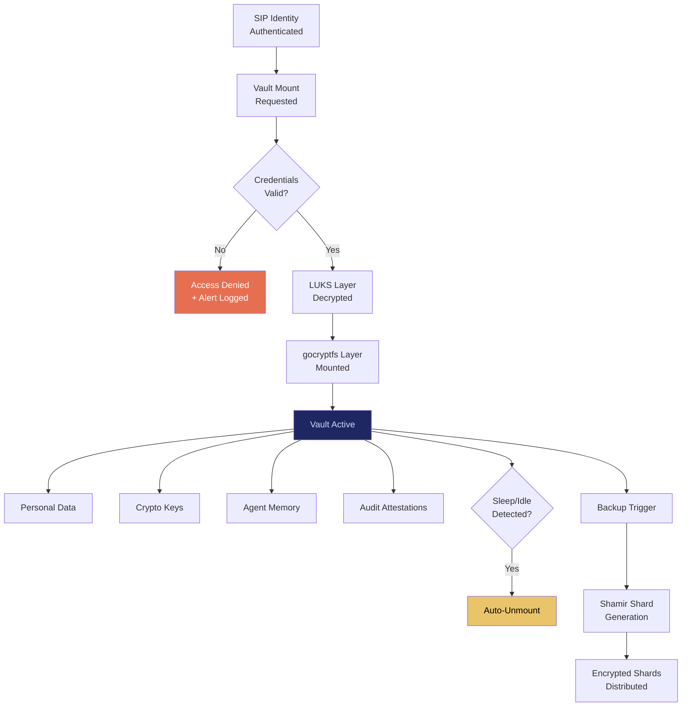

# PFV: Personal Fabric Vault

## What It Is

An encrypted, local-first data vault with shard-based distributed backup. PFV ensures that data is **signal to the owner and noise to everyone else**. Double-layer encryption (disk-level LUKS + vault-level gocryptfs/CryFS) protects data at rest and against live compromise. Auto-unmount on sleep. Zero cloud sync unless fully zero-knowledge.

PFV is the **data sovereignty primitive** of the Sovereign Intent Fabric. It stores personal data, cryptographic keys, agent memory, execution attestations, and encrypted backups — all under the owner's exclusive control.

---

## Purpose and Problem It Solves

| Problem | Current State | PFV Resolution |
|---|---|---|
| Cloud storage dependency | Google Drive, iCloud, OneDrive own user data | Local-first encrypted storage; cloud is optional extension |
| Data visible to platform admins | Cloud providers can access unencrypted data | Double-layer encryption; keys never leave device |
| No data portability | Vendor lock-in through proprietary formats | Standard encrypted container format; exportable |
| Backup fragility | Single backup location = single point of failure | Shamir-sharded encrypted backups across N locations |
| Agent memory persistence | AI agent context lost between sessions | Encrypted agent memory store inside vault |
| Compliance evidence storage | Audit trails scattered across systems | Centralized encrypted attestation archive |

---

## Technical Specification

### Inputs

| Input | Description |
|---|---|
| SIP identity token | Owner identity for vault access control |
| Data payload | Files, keys, agent memory, attestations |
| Backup configuration | Shard count (N), quorum threshold (K), backup targets |
| Mount credentials | Passphrase or TPM-bound unlock |

### Outputs

| Output | Description |
|---|---|
| Encrypted vault container | Mountable encrypted filesystem |
| Backup shards | Shamir-split encrypted fragments distributed to N targets |
| Access log | Immutable record of vault mount/unmount events |
| Data export package | Portable encrypted archive for migration |

### Key Interfaces

```
PFV.createVault(sipToken, encryptionConfig) → VaultID
PFV.mountVault(vaultID, credentials) → MountPoint
PFV.unmountVault(vaultID) → UnmountConfirmation
PFV.storeData(vaultID, path, payload) → StorageReceipt
PFV.backup(vaultID, shardConfig) → BackupManifest
PFV.restore(shardSet, quorum) → RestoredVaultID
PFV.export(vaultID, format) → EncryptedArchive
```

### Encryption Stack

| Layer | Implementation |
|---|---|
| Disk encryption | LUKS (full disk) |
| Vault encryption | gocryptfs or CryFS (per-vault) |
| Key derivation | Argon2id |
| Backup sharding | Shamir Secret Sharing (K-of-N) |
| Algorithm suite | Consumes PQCS primitives |

---

## Architecture



---

## Integration Points

| Component | Integration |
|---|---|
| **SIP** | Vault access controlled by sovereign identity token |
| **ESR** | Execution attestations stored in vault; agent data mounted read-only per contract |
| **SACS** | Agent contracts reference vault data scopes |
| **PQCS** | Encryption algorithms sourced from post-quantum suite |
| **ITP** (Intent Translation Protocol) | Cryptographic heir-transfer of vault contents on death/incapacity |
| **CE** | Access logs subject to compliance audit |
| **DVE** (Distributed Verification Engine) | Vault integrity verification |
| **ORF** | Data obligations tracked; vault data referenced in obligation evidence |
| **MCO** | Vault data has enforced retention/expiry policies |

---

## Implementation Priority

**Phase 1 — Years 0-1 (Survive & Prove)**

PFV is the **second deliverable shipped** after SIP, per the build progression:
`SIP → PFV → ESR → SACS → IOO (for one vertical)`.

- Month 1-3: Encrypted vault creation on production sovereign node
- Month 3-6: Auto-unmount on sleep, Shamir backup to external drive
- Month 6-12: Agent memory persistence, execution attestation archival
- First deployment: Encrypted document vault for law firm confidential AI node

---

## Constraints

- No raw cloud sync. Backup must be encrypted + sharded before leaving device.
- Auto-unmount on sleep/idle is mandatory, not configurable.
- No plaintext key export. Private keys are non-extractable.
- Recovery requires minimum K-of-N shard quorum.
- Vault access logs are immutable and cannot be purged by the owner.

---

## User Level Access

| Level | Profile | PFV Capability |
|---|---|---|
| L1 | Everyday Individual | Personal vault, single device |
| L2 | Power User / Builder | Multi-vault, agent memory store |
| L3 | Enterprise Node | Organizational vault hierarchy |
| L4 | Network Operator | Cross-org vault federation policy |
| L5 | Protocol Steward | Vault format specification governance |

---

## Related Deliverables

- [SIP — Sovereign Identity Primitive](./01-sip)
- [ESR — Edge Sovereignty Runtime](./02-esr)
- [ITP — Intent Translation Protocol](./04-itp)
- [PQCS — Post-Quantum Cryptographic Suite](./11-pqcs)
- [DVE — Distributed Verification Engine](./14-dve)
