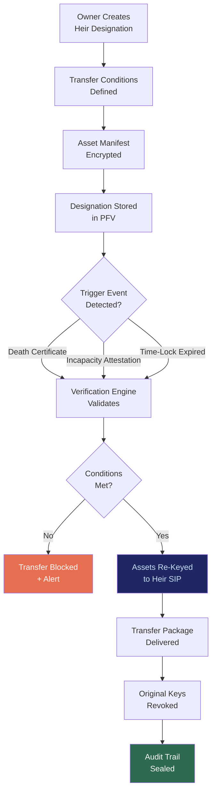

# ITP: Intent Translation Protocol

## What It Is

A cryptographic heir-transfer mechanism that enables the secure, verifiable transfer of sovereign identity, data vaults, and agent configurations to designated legal heirs upon death or incapacity. ITP ensures that **sovereignty persists beyond the individual** — no platform administrator, no terms-of-service clause, and no corporate policy can override the owner's declared transfer intent.

In the source architecture, this is the **Inheritance Transfer Protocol** — the mechanism that prevents digital feudalism where platforms control legacy access.

---

## Purpose and Problem It Solves

| Problem | Current State | ITP Resolution |
|---|---|---|
| Platform-controlled digital legacy | Google, Apple, Meta decide what heirs can access | Owner-declared transfer instructions enforced cryptographically |
| Terms-of-service inheritance | Platform ToS overrides owner intent after death | Cryptographic transfer cannot be overridden by any third party |
| Identity loss on death | Digital identities die with the person | Sovereign identity transfer to designated successors |
| Legal-jurisdiction mismatch | Cross-border inheritance laws conflict with platform policies | Jurisdiction-aware transfer logic embedded in protocol |
| Key recovery without owner | Private keys unrecoverable after death | Pre-configured heir transfer with time-locked activation |

---

## Technical Specification

### Inputs

| Input | Description |
|---|---|
| SIP identity token | Owner's sovereign identity |
| Heir designation | Cryptographic identifiers of designated successors |
| Transfer conditions | Death certificate verification, incapacity attestation, time-lock triggers |
| Asset manifest | List of vaults, keys, agent configs, and data scopes to transfer |
| Jurisdiction binding | Legal jurisdiction rules governing the transfer |

### Outputs

| Output | Description |
|---|---|
| Transfer package | Encrypted asset bundle re-keyed to heir's SIP identity |
| Transfer attestation | Cryptographic proof of valid transfer execution |
| Audit trail | Immutable record of transfer conditions met and actions taken |
| Revocation of original keys | Owner's keys rendered inactive post-transfer |

### Key Interfaces

```
ITP.designateHeirs(sipToken, heirList, conditions) → HeirDesignation
ITP.setTransferConditions(designationID, triggers) → TransferPolicy
ITP.initiateTransfer(deathAttestation, heirSipToken) → TransferPackage
ITP.verifyTransfer(transferID) → TransferAttestation
ITP.revokeDesignation(sipToken, designationID) → RevocationConfirmation
ITP.updateAssetManifest(sipToken, manifest) → UpdatedManifest
```

---

## Transfer Flow



---

## Integration Points

| Component | Integration |
|---|---|
| **SIP** | Owner and heir identities are SIP tokens; transfer re-keys to heir's SIP |
| **PFV** | Heir designations and encrypted asset manifests stored in owner's vault |
| **PQCS** | Re-keying uses post-quantum algorithms for future-proof transfer |
| **DVE** | Transfer conditions verified by distributed verification engine |
| **CE** | Transfer actions subject to compliance audit and cooling-off periods |
| **GPL** (Governance Policy Language) | Jurisdiction-specific inheritance rules encoded as governance policies |
| **ORF** | Transfer creates obligations that must reach finality |
| **MCO** | All transfer designations have enforced expiry; must be renewed |

---

## Implementation Priority

**Phase 2 — Years 1-2 (Stabilize & Standardize)**

ITP is a **second-order deliverable**. It requires stable SIP, PFV, and PQCS before implementation.

- Month 12-18: Heir designation schema and encrypted manifest storage
- Month 18-24: Time-lock trigger mechanism and death certificate verification integration
- Month 24-30: Cross-jurisdiction transfer logic with GPL policy encoding

---

## Constraints

- Transfer designations must be renewed periodically (MCO-enforced expiry).
- No single party can trigger transfer unilaterally; multi-condition verification required.
- Cooling-off period mandatory between trigger detection and asset re-keying.
- Original owner keys are permanently revoked post-transfer; no dual-access window.
- Jurisdiction conflict resolution follows explicit priority rules, not platform discretion.

---

## User Level Access

| Level | Profile | ITP Capability |
|---|---|---|
| L1 | Everyday Individual | Basic heir designation (1-2 heirs) |
| L2 | Power User / Builder | Multi-heir with conditional logic |
| L3 | Enterprise Node | Organizational succession planning |
| L4 | Network Operator | Cross-organization transfer policy |
| L5 | Protocol Steward | Inheritance schema governance |

---

## Related Deliverables

- [SIP — Sovereign Identity Primitive](./01-sip)
- [PFV — Personal Fabric Vault](./03-pfv)
- [PQCS — Post-Quantum Cryptographic Suite](./11-pqcs)
- [DVE — Distributed Verification Engine](./14-dve)
- [GPL — Governance Policy Language](./12-gpl)
