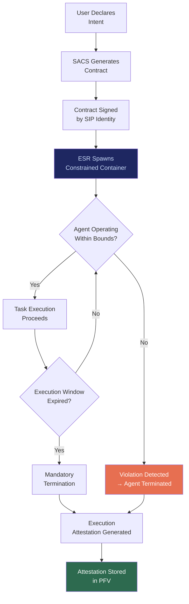

# SACS: Sovereign Agent Coordination System

## What It Is

A system of cryptographic capability contracts that define hard execution boundaries for AI agents. Every agent operates under a scoped contract specifying what it can access, for how long, with what resources, and which other agents it can call. No agent can expand its own scope. No agent persists beyond its defined execution window.

SACS is the **delegation primitive** of the Sovereign Intent Fabric. It answers the question: how do you give agents power without giving them authority?

---

## Purpose and Problem It Solves

| Problem | Current State | SACS Resolution |
|---|---|---|
| Silent authority expansion | Cloud AI agents accumulate persistent access over time | Cryptographic contracts prevent scope expansion |
| No execution boundaries | Agents access full user data by default | Explicit data mount per contract; no blanket access |
| Persistent agent state | Agents maintain long-running sessions with growing context | Ephemeral execution windows with mandatory termination |
| Recursive delegation risk | Agent A calls Agent B which calls Agent C without oversight | Declared dependency graph; no calls outside graph |
| Unauditable agent behavior | No record of what agents actually did | Execution attestations for every agent lifecycle event |

---

## Technical Specification

### Inputs

| Input | Description |
|---|---|
| SIP identity token | Identity of the delegating user/entity |
| Agent capability descriptor | What the agent can do (model, tools, data scope) |
| Execution window | Start time, max duration, hard deadline |
| Resource limits | CPU, GPU, memory, network bandwidth caps |
| Dependency graph | Allowed inter-agent calls |
| Data mount specification | Exact PFV paths accessible (read-only by default) |

### Outputs

| Output | Description |
|---|---|
| Signed agent contract | Cryptographic document binding agent to scope |
| Execution attestation | Proof of what the agent actually did within contract bounds |
| Violation report | Alert if agent attempted out-of-scope action |
| Resource consumption receipt | Actual vs. allocated resource usage |

### Key Interfaces

```
SACS.createContract(sipToken, capabilities, window, limits) → SignedContract
SACS.deployAgent(contract, model) → AgentDeployment
SACS.monitorAgent(deploymentID) → AgentStatus
SACS.terminateAgent(deploymentID) → ExecutionAttestation
SACS.validateDependency(agentA, agentB) → DependencyValidation
SACS.reportViolation(deploymentID, violation) → ViolationReport
```

### Contract Schema

| Field | Type | Required | Description |
|---|---|---|---|
| `identity` | SIP Token | Yes | Delegating identity |
| `capabilities` | Capability[] | Yes | Permitted operations |
| `dataScope` | Path[] | Yes | Allowed data access paths |
| `executionWindow` | TimeRange | Yes | Start/end/max duration |
| `resourceLimits` | ResourceSpec | Yes | Hard caps on compute resources |
| `dependencyGraph` | AgentID[] | No | Allowed inter-agent calls |
| `networkPolicy` | NetworkSpec | Yes | Default: `none`; explicit allow-list |
| `auditLevel` | Enum | Yes | `minimal`, `standard`, `full` |

---

## Contract Lifecycle



---

## Integration Points

| Component | Integration |
|---|---|
| **SIP** | All contracts signed by sovereign identity; no anonymous delegation |
| **ESR** | ESR enforces contract constraints at container level |
| **PFV** | Data scope references vault paths; attestations stored in vault |
| **IOO** | Execution results flow to outcome oracle for feedback |
| **CE** | Time-bound authority decay applied to long-running contracts |
| **AIP** (Agent Interoperability Protocol) | Cross-ecosystem agent calls validated against dependency graph |
| **ORF** | Each agent execution creates tracked obligation |
| **ETLB** | Liability for agent output bound to delegating SIP identity |
| **MCO** | No immortal contracts; all have enforced expiry |

---

## Implementation Priority

**Phase 1 — Years 0-1 (Survive & Prove)**

SACS is part of the non-negotiable nucleus: `SIP + ESR + SACS + CE`.

- Month 3-6: Basic contract schema with scope, duration, and resource limits
- Month 6-9: Violation detection and mandatory termination
- Month 9-12: Dependency graph validation and inter-agent call control
- First deployment: Scoped agent contracts for law firm document analysis agents

---

## Constraints

- No agent can modify its own contract.
- No agent persists beyond its execution window without explicit renewal.
- Data access is read-only by default; write requires explicit grant.
- Network access is denied by default; requires explicit allow-list.
- Recursive delegation depth is hard-capped (default: 2 levels).
- All violations result in immediate termination and attestation generation.

---

## User Level Access

| Level | Profile | SACS Capability |
|---|---|---|
| L1 | Everyday Individual | Not enabled (pre-configured agents only) |
| L2 | Power User / Builder | Custom agent contracts, local execution |
| L3 | Enterprise Node | Multi-agent orchestration with dependency graphs |
| L4 | Network Operator | Cross-organization agent coordination |
| L5 | Protocol Steward | Contract schema governance |

---

## Related Deliverables

- [SIP — Sovereign Identity Primitive](./01-sip)
- [ESR — Edge Sovereignty Runtime](./02-esr)
- [PFV — Personal Fabric Vault](./03-pfv)
- [AIP — Agent Interoperability Protocol](./17-aip)
- [CE — Compliance Engine](./15-ce)
