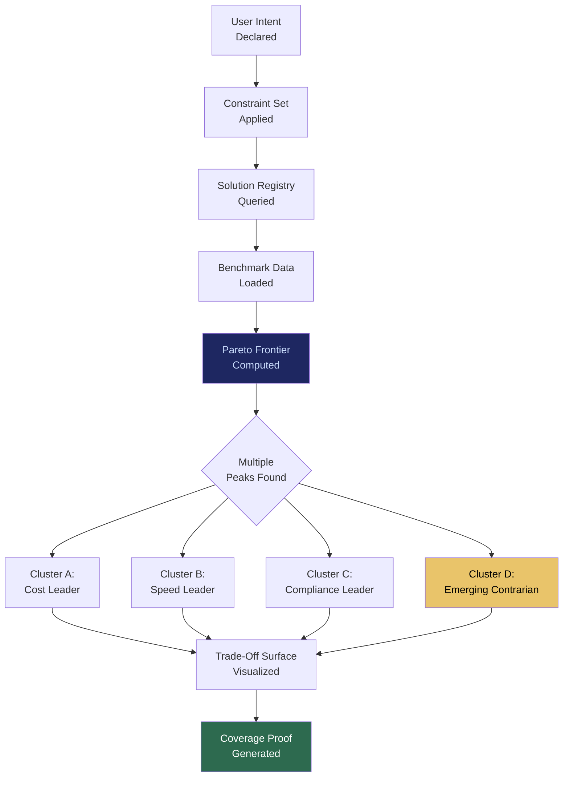

# CGE: Computational Governance Engine

## What It Is

A multidimensional solution landscape engine that replaces ranked lists with navigable capability topologies. Instead of declaring a single "best" result, CGE maps solutions across cost, speed, compliance, reliability, open-source friendliness, and experimental edge — exposing **Pareto frontiers** where multiple peaks coexist.

In the source architecture, this is the **Capability Graph Engine** — the mechanism that eliminates visibility scarcity and replaces search hierarchy with landscape navigation.

---

## Purpose and Problem It Solves

| Problem | Current State | CGE Resolution |
|---|---|---|
| Ranking creates artificial scarcity | Top 3 results capture 90% of attention | Multidimensional landscape shows all non-dominated solutions |
| Popularity bias compounds | Early movers dominate; new entrants buried | Niche-aware topology surfaces specialized performers |
| Single-metric optimization | "Best" collapses multi-objective reality into one score | Pareto frontier computation preserves trade-off structure |
| Vendor gaming | SEO/ad-spend distorts ranking | Cross-signal validation with randomized sampling resists capture |
| Decision regret | Users fear missing hidden gems | Perceived exhaustiveness through visible methodology |

---

## Technical Specification

### Inputs

| Input | Description |
|---|---|
| Intent declaration | User's structured goal from IDE |
| Constraint set | Budget, jurisdiction, compliance requirements, risk tolerance |
| Solution registry | Live index of tools, models, APIs, services |
| Performance telemetry | Historical benchmark data from SCM and ESR |
| Exploration budget | Percentage of results reserved for emerging/underrepresented solutions |

### Outputs

| Output | Description |
|---|---|
| Capability topology | Multidimensional map of non-dominated solution clusters |
| Pareto frontier set | Trade-off surfaces across user-selected dimensions |
| Coverage proof | Methodology report: X providers indexed, Y configurations simulated, Z dominated strategies eliminated |
| Contrarian highlights | Emerging solutions outperforming quietly |

### Key Interfaces

```
CGE.mapLandscape(intent, constraints) → CapabilityTopology
CGE.computePareto(topology, dimensions) → ParetoFrontierSet
CGE.getCoverageProof(queryID) → CoverageReport
CGE.getContrarians(topology, threshold) → ContrarianSolution[]
CGE.setExplorationBudget(percentage) → BudgetConfirmation
CGE.reweight(dimensions, weights) → ReweightedTopology
```

### Evaluation Dimensions

| Dimension | Weight (User Configurable) | Source |
|---|---|---|
| Cost efficiency | Variable | Pricing data + SCM benchmarks |
| Speed / latency | Variable | Performance telemetry |
| Compliance readiness | Variable | CE audit data |
| Reliability / uptime | Variable | Historical SLA data |
| Open-source friendliness | Variable | License analysis |
| Innovation / experimental edge | Variable | Exploration engine signals |

---

## Landscape Navigation



---

## Integration Points

| Component | Integration |
|---|---|
| **IDE** (Intent Discovery Engine) | Receives clarified intent as input for landscape mapping |
| **EE** (Exploration Engine) | Supplies emerging/underrepresented solutions for contrarian injection |
| **IOO** | Landscape selection feeds into outcome orchestration pipeline |
| **SCM** | Benchmark and pricing data from compute marketplace |
| **ESR** | Performance telemetry from edge runtime deployments |
| **CE** | Compliance readiness scores from constraint engine |
| **GPL** | Scoring logic transparency enforced by governance policy |
| **ORF** | Solution selection creates trackable obligation |

---

## Implementation Priority

**Phase 2 — Years 1-2 (Stabilize & Standardize)**

CGE is an **L3 (Enterprise Node)** deliverable. It requires stable ESR, IOO, and CE before landscape data is meaningful.

- Month 12-18: Internal solution registry with benchmark data from first deployments
- Month 18-24: Pareto frontier computation for AI model/infra selection
- Month 24-30: Coverage proof generation and contrarian highlighting
- First use case: Enterprise AI tool selection for sovereign node customers

---

## Constraints

- No single universal ranking. All results are cluster-based with explicit trade-off dimensions.
- Scoring logic must be transparent, auditable, and parameterized per user.
- Exploration budget (minimum 10%) is structural; cannot be set to zero.
- No ad-based ranking. No pay-to-rank. Revenue model is outcome-based.
- Scoring must resist gaming through randomized sampling and cross-signal validation.
- Users can change optimization weights; no platform-imposed hierarchy.

---

## User Level Access

| Level | Profile | CGE Capability |
|---|---|---|
| L1 | Everyday Individual | Not enabled |
| L2 | Power User / Builder | Basic landscape view |
| L3 | Enterprise Node | Full Pareto computation with custom dimensions |
| L4 | Network Operator | Cross-organization landscape federation |
| L5 | Protocol Steward | Scoring methodology governance |

---

## Related Deliverables

- [IDE — Intent Discovery Engine](./07-ide)
- [EE — Exploration Engine](./09-ee)
- [IOO — Intent Outcome Oracle](./08-ioo)
- [SCM — Sovereign Compute Marketplace](./10-scm)
- [GPL — Governance Policy Language](./12-gpl)
