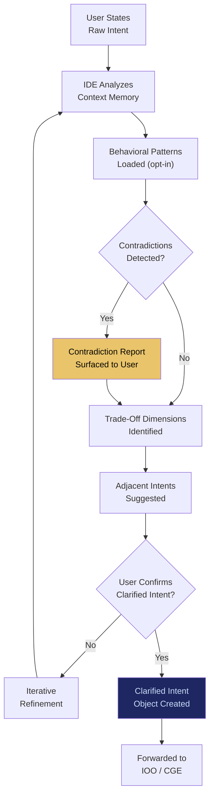

# IDE: Intent Discovery Engine

## What It Is

A reflective and behavioral pattern clarification layer that helps users understand their own intent before execution begins. IDE operates as an **intent mirror** — combining conversational reflection with behavioral signal analysis to surface latent goals, expose contradictions, and clarify trade-offs. It acts as a mirror, not a puppeteer.

IDE addresses the gap between what users ask for and what they actually need. Most systems execute intent as stated. IDE clarifies intent before execution, preventing cargo-cult behavior and impulse-driven decisions.

---

## Purpose and Problem It Solves

| Problem | Current State | IDE Resolution |
|---|---|---|
| Users misidentify their own intent | "I want X" when they actually need Y | Reflective questioning + behavioral pattern surfacing |
| Impulse-driven execution | Systems execute immediately without validating intent | Structured intent clarification before action |
| Query formulation weakness | Users don't know what they don't know | Adjacent domain discovery and question expansion |
| Cargo-cult behavior | Users copy solutions without understanding context | Trade-off surfacing shows why, not just what |
| Algorithmic manipulation risk | Engagement-optimized systems shape user desire | IDE clarifies without steering; no engagement metrics |

---

## Technical Specification

### Inputs

| Input | Description |
|---|---|
| Raw intent statement | User's initial declaration of what they want |
| Behavioral signals (opt-in) | Usage patterns, decision history, outcome feedback |
| Context memory | Persistent semantic memory from PFV |
| Domain ontology | Industry-specific knowledge graphs |
| Constraint profile | User's risk appetite, budget, jurisdiction, timeline |

### Outputs

| Output | Description |
|---|---|
| Clarified intent object | Structured, validated intent ready for execution |
| Contradiction report | Identified conflicts between stated intent and behavioral patterns |
| Trade-off visualization | Explicit dimensions where intent involves trade-offs |
| Adjacent intent suggestions | Related goals the user may not have considered |
| Confidence score | System's confidence in intent interpretation |

### Key Interfaces

```
IDE.clarifyIntent(rawIntent, contextMemory) → ClarifiedIntent
IDE.analyzePatterns(behavioralSignals, timeRange) → PatternReport
IDE.surfaceContradictions(intent, history) → ContradictionReport
IDE.suggestAdjacent(intent, domainOntology) → AdjacentIntentList
IDE.validateReadiness(clarifiedIntent) → ReadinessAssessment
```

### Intent Clarification Modes

| Mode | Description | Use Case |
|---|---|---|
| Conversational | Interactive dialogue to refine intent | Individual users, founders |
| Behavioral synthesis | Periodic analysis of usage patterns | Power users, recurring workflows |
| Hybrid | Conversation informed by behavioral data | Enterprise decision-makers |

---

## Intent Clarification Flow



---

## Integration Points

| Component | Integration |
|---|---|
| **IOO** | Receives clarified intent for simulation and execution |
| **CGE** | Receives clarified intent for landscape mapping |
| **PFV** | Reads context memory and decision history from vault |
| **EE** (Exploration Engine) | Supplies adjacent domain awareness for intent expansion |
| **CUXF** (Civilizational UX Framework) | IDE presentation follows agency-aligned, non-addictive UX principles |
| **CE** | High-impact intents trigger mandatory reflection before execution |
| **ORF** | Intent clarification logged as part of obligation creation chain |

---

## Implementation Priority

**Phase 1 — Years 0-1 (Survive & Prove)**

IDE is an **L1 (Everyday Individual)** deliverable — part of the first user-facing set: `SIP, PFV, IDE, CUXF`.

- Month 6-9: Conversational intent clarification for law firm use case
- Month 9-12: Context memory integration with PFV
- Month 12-18: Behavioral pattern analysis (opt-in) and contradiction surfacing
- First deployment: "What do you actually need this document analysis to do?" before launching agent tasks

---

## Constraints

- IDE clarifies intent; it does not steer or manipulate. No engagement metrics.
- Behavioral analysis is strictly opt-in. Users control what signals are analyzed.
- IDE must never create urgency or artificial scarcity in its prompting.
- Contradiction reports are informational, not blocking. User retains full override.
- Adjacent intent suggestions are bounded by user's declared domain; no unbounded exploration.
- All clarification interactions are logged but never used for ad targeting.

---

## Ethical Design Principles

| Principle | Implementation |
|---|---|
| Mirror, not puppeteer | IDE reflects patterns; it does not suggest what users should want |
| Amplify clarity, not impulse | No engagement-optimized prompting |
| User retains agency | All suggestions are overridable; no forced flows |
| Transparency of method | Users can see why IDE made a suggestion |

---

## User Level Access

| Level | Profile | IDE Capability |
|---|---|---|
| L1 | Everyday Individual | Conversational intent clarification |
| L2 | Power User / Builder | + Behavioral pattern analysis |
| L3 | Enterprise Node | + Organizational intent alignment |
| L4 | Network Operator | Cross-organization intent federation |
| L5 | Protocol Steward | Intent schema governance |

---

## Related Deliverables

- [IOO — Intent Outcome Oracle](./08-ioo)
- [CGE — Computational Governance Engine](./06-cge)
- [EE — Exploration Engine](./09-ee)
- [PFV — Personal Fabric Vault](./03-pfv)
- [CUXF — Civilizational UX Framework](./18-cuxf)
