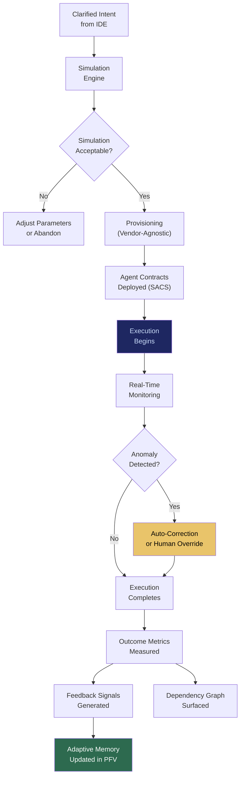

# IOO: Intent Outcome Oracle

## What It Is

A simulation, execution, and feedback pipeline that takes clarified intent and converts it into measurable outcomes. IOO orchestrates multi-system execution — provisioning infrastructure, deploying models, routing APIs, triggering compliance checks, and monitoring results — while maintaining reversibility, modularity, and vendor-agnostic routing.

IOO is the **execution primitive** of the Sovereign Intent Fabric. It collapses execution friction: the bottleneck between knowing what you want and getting it done.

---

## Purpose and Problem It Solves

| Problem | Current State | IOO Resolution |
|---|---|---|
| Manual multi-app coordination | Users hop between 10+ SaaS tools to execute one workflow | Single intent-to-outcome pipeline |
| No simulation before execution | Actions are irreversible; no preview of consequences | Outcome simulation with trade-off visualization |
| Feedback disconnected from action | Dashboards report after the fact; no closed loop | Continuous feedback integrated into execution cycle |
| Vendor lock-in through workflow | Switching tools means rebuilding workflows | Vendor-agnostic routing; portable execution descriptors |
| Execution without accountability | No record of what was tried, what failed, what succeeded | Full execution attestation with dependency tracing |

---

## Technical Specification

### Inputs

| Input | Description |
|---|---|
| Clarified intent | Validated intent object from IDE |
| Constraint profile | Budget, timeline, risk tolerance, jurisdiction |
| Landscape selection | Chosen solution cluster from CGE |
| Agent contracts | SACS-defined execution boundaries |
| Simulation parameters | What-if scenarios to evaluate before execution |

### Outputs

| Output | Description |
|---|---|
| Simulation results | Predicted outcomes across selected scenarios |
| Execution attestation | Cryptographic proof of execution steps, data access, and results |
| Outcome metrics | Cost delta, performance delta, error rate, compliance friction |
| Feedback signals | Structured data for adaptive memory and future optimization |
| Dependency graph | What external systems, APIs, and services were used |

### Key Interfaces

```
IOO.simulate(intent, constraints, scenarios) → SimulationResults
IOO.execute(intent, landscape, contracts) → ExecutionID
IOO.monitorExecution(executionID) → ExecutionStatus
IOO.rollback(executionID) → RollbackConfirmation
IOO.getOutcomeMetrics(executionID) → OutcomeMetrics
IOO.getFeedback(executionID) → FeedbackSignals
IOO.getDependencyGraph(executionID) → DependencyGraph
```

### Execution Pipeline

| Stage | Description | Reversibility |
|---|---|---|
| Simulation | Predict outcomes without committing | Fully reversible (no action taken) |
| Provisioning | Set up required infrastructure/services | Reversible within window |
| Execution | Run agents against data/systems | Partially reversible (depends on action type) |
| Monitoring | Track progress, detect anomalies | N/A |
| Feedback | Measure outcomes against intent | N/A |
| Learning | Update adaptive memory for future executions | N/A |

---

## Orchestration Flow



---

## Integration Points

| Component | Integration |
|---|---|
| **IDE** | Receives clarified intent as execution input |
| **CGE** | Landscape selection determines execution strategy |
| **SACS** | Agent contracts define execution boundaries |
| **ESR** | Edge runtime executes local compute tasks |
| **PFV** | Execution attestations and adaptive memory stored in vault |
| **DVE** | Hidden dependency surfacing after outcomes |
| **CE** | High-impact executions trigger cooling-off and reflection |
| **SCM** | Compute marketplace supplies additional resources when needed |
| **ORF** | Every execution step creates tracked obligation |
| **ETLB** | Execution liability bound to initiating identity |

---

## Implementation Priority

**Phase 1 — Years 0-1 (Survive & Prove)**

IOO is the **fifth deliverable in build order**, scoped to ONE vertical:
`SIP → PFV → ESR → SACS → IOO (for one vertical)`.

- Month 6-12: Basic execution pipeline for law firm document analysis
- Month 12-18: Simulation engine for outcome prediction
- Month 18-24: Vendor-agnostic routing and feedback loop integration
- First deployment: "Summarize these 500 contracts, flag risk clauses, report cost vs. manual" — end to end

---

## Constraints

- All executions are reversible by default where technically possible.
- Simulation is mandatory for high-impact operations (capital movement, mass data access, compliance-affecting actions).
- Vendor-agnostic routing; no hard dependency on any single cloud or model provider.
- Dependency graphs are surfaced to users, not hidden. Outcomes must not create false mastery.
- Feedback signals are outcome-based (cost, performance, errors), not engagement-based.

---

## User Level Access

| Level | Profile | IOO Capability |
|---|---|---|
| L1 | Everyday Individual | Not enabled |
| L2 | Power User / Builder | Basic execution with simulation |
| L3 | Enterprise Node | Full orchestration with dependency tracing |
| L4 | Network Operator | Cross-organization execution federation |
| L5 | Protocol Steward | Execution pipeline governance |

---

## Related Deliverables

- [IDE — Intent Discovery Engine](./07-ide)
- [CGE — Computational Governance Engine](./06-cge)
- [SACS — Sovereign Agent Coordination System](./05-sacs)
- [ESR — Edge Sovereignty Runtime](./02-esr)
- [DVE — Distributed Verification Engine](./14-dve)
