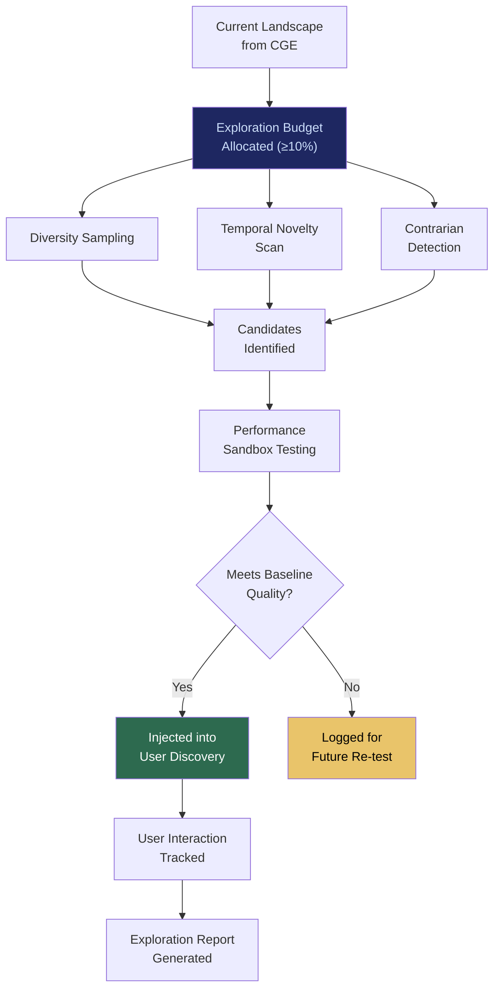

# EE: Exploration Engine

## What It Is

A structured novelty injection engine that deliberately fights optimization gravity. While engagement-optimized feeds narrow possibility space over time, EE injects emerging solutions, underexposed performers, contrarian clusters, and adjacent domains into the user's discovery surface. This is the **anti-reels architecture**: guided variance instead of dopamine-driven tunneling.

EE exists because algorithmic narrowing is not a bug — it is the business model of every major platform. EE is a structural rebellion against that model.

---

## Purpose and Problem It Solves

| Problem | Current State | EE Resolution |
|---|---|---|
| Algorithmic tunnel vision | Feeds optimize for engagement, narrowing content diversity | Structural exploration budget (minimum 10%) |
| Hidden gems buried | Under-marketed, niche solutions invisible in ranked systems | Diversity sampling from underrepresented providers |
| Innovation suppressed | Popularity-based ranking entrenches incumbents | Emerging node surfacing with performance sandboxing |
| Dopamine-driven discovery | Infinite scroll rewards reaction, not reflection | Guided variance rewarding cognitive expansion |
| Search reinforcement loops | Popular gets more popular; new gets buried | Rotating exposure based on qualification, not ad spend |

---

## Technical Specification

### Inputs

| Input | Description |
|---|---|
| Current landscape topology | Solution clusters from CGE |
| User exploration history | Previous discoveries and interactions |
| Diversity targets | Minimum representation thresholds for categories |
| Sandbox results | Benchmark data from performance sandboxing of new solutions |
| Temporal novelty signals | Recently emerged tools, papers, APIs |

### Outputs

| Output | Description |
|---|---|
| Exploration candidates | Curated set of novel/underrepresented solutions |
| Contrarian highlights | Solutions outperforming quietly outside mainstream visibility |
| Adjacent domain connections | Cross-domain linkages user hasn't explored |
| Exploration report | What was surfaced, why, and performance indicators |

### Key Interfaces

```
EE.injectNovelty(landscape, diversityTargets) → ExplorationSet
EE.sandboxTest(candidate, benchmarkSuite) → SandboxResults
EE.getContrarians(landscape, performanceThreshold) → ContrarianList
EE.getAdjacentDomains(intent, ontology) → AdjacentDomainMap
EE.setExplorationBudget(percentage) → BudgetConfirmation
EE.getExplorationReport(sessionID) → ExplorationReport
```

### Exploration Strategies

| Strategy | Mechanism | Purpose |
|---|---|---|
| Diversity sampling | Pull from underrepresented categories | Prevent monoculture |
| Performance sandboxing | Test unknowns in isolated environments | Validate before recommending |
| Temporal novelty | Surface recently emerged solutions | Prevent staleness |
| Contrarian detection | Identify solutions with good benchmarks but low visibility | Find hidden gems |
| Adjacent domain injection | Show cross-field solutions | Prevent tunnel vision |

---

## Anti-Reels Architecture



### Reels vs. EE: Structural Comparison

| Dimension | Reels (Engagement-Optimized) | EE (Exploration-Optimized) |
|---|---|---|
| Optimization target | Watch time, scroll velocity | Cognitive expansion, discovery breadth |
| Feedback loop | Narrow user preferences over time | Widen possibility frontier |
| Novelty type | Micro-novelty (same genre, different clip) | Structural novelty (new domains, new solutions) |
| User posture | Passive consumption | Active exploration |
| Revenue model | Attention capture for ads | Outcome-based; no ad revenue |
| Result | Personalized confinement | Guided abundance |

---

## Integration Points

| Component | Integration |
|---|---|
| **CGE** | Provides base landscape; EE injects exploration candidates into it |
| **IDE** | Adjacent domain awareness feeds intent clarification |
| **IOO** | Exploration candidates can be selected for outcome orchestration |
| **SCM** | Sandbox testing uses compute marketplace resources |
| **CUXF** | Exploration presentation follows anti-addictive UX principles |
| **GPL** | Exploration budget and methodology subject to governance audit |
| **ORF** | Exploration recommendations tracked as obligations |

---

## Implementation Priority

**Phase 1-2 — Years 0-2 (Survive & Prove / Stabilize)**

EE is an **L2 (Power User / Builder)** deliverable.

- Month 9-12: Basic diversity sampling for AI model recommendations
- Month 12-18: Performance sandboxing for unknown solutions
- Month 18-24: Contrarian detection and adjacent domain injection
- First use case: "Here are 3 dominant AI models for your task. Here are 2 emerging alternatives. Here is 1 contrarian option outperforming quietly."

---

## Constraints

- Exploration budget cannot be set below 10%. Structural minimum enforced.
- No ad-driven amplification. No pay-to-rank. No engagement-based scoring.
- Sandbox testing is required before any unknown solution is recommended.
- Randomized sampling prevents vendors from gaming exposure.
- Exploration reports are transparent: users see why something was surfaced.
- EE never optimizes for retention or session length.

---

## User Level Access

| Level | Profile | EE Capability |
|---|---|---|
| L1 | Everyday Individual | Passive exploration (adjacent suggestions in IDE) |
| L2 | Power User / Builder | Full exploration engine with custom diversity targets |
| L3 | Enterprise Node | Enterprise exploration with sandbox testing |
| L4 | Network Operator | Cross-organization exploration federation |
| L5 | Protocol Steward | Exploration methodology governance |

---

## Related Deliverables

- [CGE — Computational Governance Engine](./06-cge)
- [IDE — Intent Discovery Engine](./07-ide)
- [IOO — Intent Outcome Oracle](./08-ioo)
- [SCM — Sovereign Compute Marketplace](./10-scm)
- [CUXF — Civilizational UX Framework](./18-cuxf)
