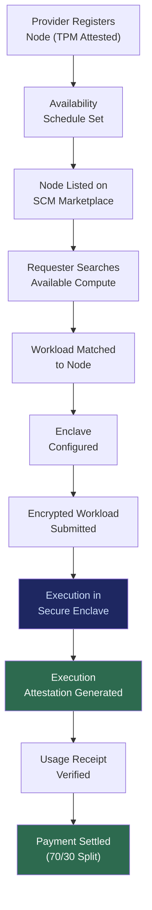

# SCM: Sovereign Compute Marketplace

## What It Is

An enclave-based marketplace for securely leasing idle compute capacity. SCM enables enterprises and individuals to monetize underutilized hardware (GPUs, CPUs, NPUs) through cryptographic attestation, verified workloads, and fixed resource caps — without exposing private data or surrendering hardware control.

SCM is not a consumer GPU mining circus. It is **enterprise-to-enterprise compute sharing** with enclave execution, mutual trust proofs, and verifiable resource boundaries.

---

## Purpose and Problem It Solves

| Problem | Current State | SCM Resolution |
|---|---|---|
| Centralized cloud dominance | AWS, Azure, GCP capture 65%+ of cloud compute spend | Distributed compute mesh reduces cloud dependency |
| Idle hardware wasted | Enterprise GPUs sit idle 60-80% of off-hours | Scheduled compute leasing during idle windows |
| Data privacy in shared compute | Multi-tenant cloud exposes workloads to side-channel risk | Enclave-based execution; data encrypted in transit and at rest |
| No trust framework for compute sharing | No way to verify hardware integrity remotely | Cryptographic attestation via TPM + secure enclaves |
| Monopoly pricing | Cloud providers set prices without competitive pressure | Market-driven pricing with transparent benchmarks |

---

## Technical Specification

### Inputs

| Input | Description |
|---|---|
| Hardware attestation | TPM-backed proof of device integrity and capability |
| Availability schedule | Time windows when compute is available for leasing |
| Workload specification | Compute requirements from requesting party |
| Enclave configuration | Isolation and encryption parameters |
| Pricing parameters | Rate per GPU-hour, minimum commitment, SLA terms |

### Outputs

| Output | Description |
|---|---|
| Compute allocation | Matched workload-to-hardware assignment |
| Execution attestation | Cryptographic proof of computation performed |
| Usage receipt | Verified resource consumption for billing |
| Revenue distribution | Payment split between compute provider and platform |

### Key Interfaces

```
SCM.registerNode(sipToken, hardwareAttestation, schedule) → NodeRegistration
SCM.listAvailableCompute(requirements) → ComputeOffers[]
SCM.requestCompute(workloadSpec, enclaveConfig) → ComputeAllocation
SCM.submitWorkload(allocationID, encryptedPayload) → ExecutionID
SCM.getUsageReceipt(executionID) → UsageReceipt
SCM.settlePayment(receiptID) → PaymentConfirmation
```

### Economic Model

| Parameter | Value |
|---|---|
| Revenue split (default) | 70% compute provider / 30% platform |
| Additional revenue per enterprise node | ~$7,200/year |
| Revenue at 50 enterprise nodes | ~$360,000/year |
| Pricing basis | Market-driven GPU-hour rates |
| SLA enforcement | Automated via execution attestation |

---

## Marketplace Flow



---

## Integration Points

| Component | Integration |
|---|---|
| **ESR** | Compute provider nodes run ESR; workloads execute in ESR containers |
| **SIP** | Provider and requester identities authenticated via SIP |
| **SACS** | Workloads run under scoped agent contracts |
| **PQCS** | Enclave encryption uses post-quantum algorithms |
| **EDCS** | Hardware certification validates node compliance for marketplace |
| **PFV** | Execution attestations stored in provider and requester vaults |
| **CE** | No workload may silently degrade host privacy; constraint enforcement |
| **ORF** | Compute agreements tracked as obligations with finality states |
| **ETLB** | Liability for compute output bound at execution time |

---

## Implementation Priority

**Phase 2-3 — Years 2-3 (Stabilize & Scale)**

SCM is an **optional expansion layer** — prioritized after core infrastructure proves stable.

- Month 18-24: Prototype compute leasing between enterprise nodes (existing customers)
- Month 24-30: Attestation framework and automated SLA enforcement
- Month 30-36: Public marketplace with dynamic pricing and cross-organization compute
- First use case: Enterprise GPU clusters leasing idle overnight compute to vetted research partners

---

## Constraints

- No workload may silently degrade host privacy. All workloads run in enclaves.
- No centralized scheduler monopoly. Multiple coordinators can operate.
- No dynamic token speculation. Payment is fiat or stable-value denomination.
- Usage must be measurable, verifiable, and bounded.
- Attestation is mandatory; unattested hardware cannot participate.
- Fixed resource caps prevent runaway workloads.

---

## User Level Access

| Level | Profile | SCM Capability |
|---|---|---|
| L1 | Everyday Individual | Not enabled |
| L2 | Power User / Builder | Compute requester (limited) |
| L3 | Enterprise Node | Full provider + requester capability |
| L4 | Network Operator | Marketplace coordinator role |
| L5 | Protocol Steward | Marketplace governance |

---

## Related Deliverables

- [ESR — Edge Sovereignty Runtime](./02-esr)
- [EDCS — Edge Data Classification System](./16-edcs)
- [PQCS — Post-Quantum Cryptographic Suite](./11-pqcs)
- [SACS — Sovereign Agent Coordination System](./05-sacs)
- [CE — Compliance Engine](./15-ce)
