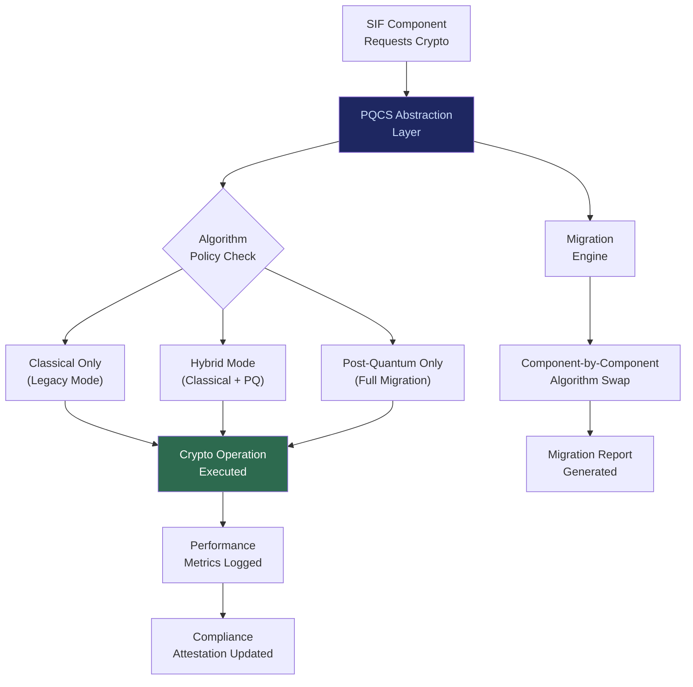

# PQCS: Post-Quantum Cryptographic Suite

## What It Is

An algorithm-agile encryption foundation that provides quantum-resistant cryptographic primitives to every component of the Sovereign Intent Fabric. PQCS does not hard-code specific ciphers. It defines an abstraction layer where encryption algorithms (key exchange, digital signatures, symmetric encryption, hashing) are swappable without breaking dependent systems.

PQCS is the **security foundation** of the entire SIF stack. Every identity, every vault, every agent contract, every execution attestation depends on cryptographic primitives. If those primitives break, sovereignty is fantasy.

---

## Purpose and Problem It Solves

| Problem | Current State | PQCS Resolution |
|---|---|---|
| RSA/ECC vulnerable to quantum | Shor's algorithm breaks current public-key cryptography | Post-quantum algorithms (CRYSTALS-Kyber, CRYSTALS-Dilithium, SPHINCS+) |
| Hard-coded cipher dependencies | Systems break when algorithms need replacement | Algorithm-agile abstraction layer; swap without breaking |
| Harvest-now-decrypt-later attacks | Adversaries storing encrypted data for future quantum decryption | Forward-secure encryption with post-quantum key exchange |
| No crypto upgrade path | Legacy systems cannot migrate without full rewrite | PQCS provides migration shims for gradual adoption |
| Performance overhead of PQ algorithms | Post-quantum signatures/key exchange are larger and slower | Hybrid mode (classical + PQ) with performance profiling |

---

## Technical Specification

### Supported Algorithm Families

| Function | Classical (Current) | Post-Quantum (Target) | Hybrid Mode |
|---|---|---|---|
| Key Exchange | X25519 | CRYSTALS-Kyber (ML-KEM) | X25519 + Kyber |
| Digital Signature | Ed25519 | CRYSTALS-Dilithium (ML-DSA) | Ed25519 + Dilithium |
| Hash-Based Signature | N/A | SPHINCS+ (SLH-DSA) | Optional fallback |
| Symmetric Encryption | AES-256-GCM | AES-256-GCM (quantum-safe at 256-bit) | No change needed |
| Key Derivation | Argon2id | Argon2id (quantum-safe) | No change needed |
| Hashing | SHA-3, BLAKE3 | SHA-3, BLAKE3 (quantum-safe) | No change needed |

### Inputs

| Input | Description |
|---|---|
| Algorithm selection policy | Which algorithms to use for which contexts |
| Performance constraints | Acceptable latency/size overhead |
| Compliance requirements | Jurisdiction-specific algorithm mandates (NIST, ANSSI, BSI) |
| Migration configuration | Gradual rollout parameters for algorithm transitions |

### Outputs

| Output | Description |
|---|---|
| Cryptographic primitives | Key generation, signing, verification, encryption, decryption |
| Algorithm migration reports | Status of transition across system components |
| Performance benchmarks | Latency and size metrics for current algorithm selection |
| Compliance attestation | Proof of algorithm compliance with regulatory requirements |

### Key Interfaces

```
PQCS.generateKeyPair(algorithmSuite) → KeyPair
PQCS.sign(privateKey, message) → Signature
PQCS.verify(publicKey, message, signature) → Boolean
PQCS.encrypt(publicKey, plaintext) → Ciphertext
PQCS.decrypt(privateKey, ciphertext) → Plaintext
PQCS.deriveKey(password, salt, params) → DerivedKey
PQCS.migrateAlgorithm(componentID, fromAlgo, toAlgo) → MigrationReport
PQCS.benchmark(algorithmSuite, workload) → PerformanceMetrics
```

---

## Algorithm Agility Architecture



---

## Integration Points

| Component | Integration |
|---|---|
| **SIP** | Identity key generation and signing use PQCS primitives |
| **PFV** | Vault encryption and key derivation via PQCS |
| **ITP** | Heir transfer re-keying uses PQCS algorithms |
| **SACS** | Agent contract signing via PQCS |
| **ESR** | Execution attestation signatures |
| **SCM** | Enclave encryption for compute marketplace |
| **DVE** | Verification engine signatures and proofs |
| **AIP** | Agent-to-agent communication encryption |
| **EDCS** | Hardware attestation cryptographic verification |
| **ORF** | Obligation signatures and finality proofs |
| **All SIF components** | PQCS is the universal cryptographic dependency |

---

## Implementation Priority

**Phase 1 — Years 0-1 (Survive & Prove)**

PQCS is an **L3 (Enterprise Node)** deliverable but its primitives are consumed from day one.

- Month 1-3: Classical algorithms (Ed25519, X25519, AES-256) via PQCS abstraction layer
- Month 6-12: Hybrid mode (classical + post-quantum) for SIP key generation
- Month 12-18: Full post-quantum option for new deployments
- Month 18-24: Migration tooling for transitioning existing deployments
- Compliance target: NIST PQC standards finalization (2024-2025 timeline)

---

## Constraints

- No hard-coded cipher anywhere in SIF. All crypto goes through PQCS abstraction.
- Algorithm policy is configurable per deployment; no platform-imposed cipher lock-in.
- Hybrid mode (classical + PQ) is the default during transition period.
- Performance overhead must be benchmarked and reported transparently.
- Jurisdiction-specific algorithm mandates (NIST, ANSSI, BSI) are respected.
- Migration must be gradual and non-breaking; no big-bang algorithm swaps.

---

## User Level Access

| Level | Profile | PQCS Capability |
|---|---|---|
| L1 | Everyday Individual | Consumes PQCS transparently (no configuration needed) |
| L2 | Power User / Builder | Algorithm selection for personal deployments |
| L3 | Enterprise Node | Full algorithm policy management and migration |
| L4 | Network Operator | Cross-organization algorithm coordination |
| L5 | Protocol Steward | Algorithm suite governance and standards |

---

## Related Deliverables

- [SIP — Sovereign Identity Primitive](./01-sip)
- [PFV — Personal Fabric Vault](./03-pfv)
- [ITP — Intent Translation Protocol](./04-itp)
- [EDCS — Edge Data Classification System](./16-edcs)
- [DVE — Distributed Verification Engine](./14-dve)
