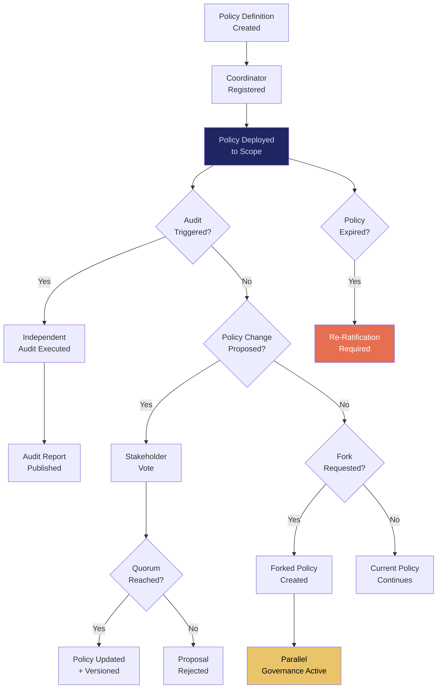

# GPL: Governance Policy Language

## What It Is

A governance framework with switchable coordinators, parallel governance models, forkable rule sets, and a transparent audit trail. GPL ensures that no single entity — not even the protocol creator — can permanently control ranking, routing, capability scoring, or economic policy. If one governance layer corrupts, the ecosystem survives.

In the source architecture, this is the **Governance Pluralism Layer** — the structural prevention of protocol tyranny.

---

## Purpose and Problem It Solves

| Problem | Current State | GPL Resolution |
|---|---|---|
| Protocol capture by large actors | Dominant players control standards bodies | Switchable coordinators; no permanent monopoly |
| Single-point governance failure | One corrupted coordinator = system compromise | Parallel coordinators with forkable rule sets |
| Opaque scoring/routing decisions | Platform algorithms are black boxes | Transparent, auditable governance policies |
| No governance upgrade path | Governance fossilizes over time | Versioned policy language with migration tooling |
| Founder centralization | Protocol creators retain permanent control | Authority decay mechanisms (integrates with OPGM) |

---

## Technical Specification

### Inputs

| Input | Description |
|---|---|
| Governance policy definition | Structured rules for coordination, scoring, routing |
| Coordinator registration | Entities offering governance services |
| Audit request | Request to verify governance compliance |
| Fork proposal | Proposed divergent rule set |
| Stakeholder vote | Ratification signal for policy changes |

### Outputs

| Output | Description |
|---|---|
| Active governance policy | Currently enforced rules for a given scope |
| Coordinator roster | Available governance providers with track records |
| Audit report | Verified compliance assessment |
| Fork manifest | Divergent rule set with migration instructions |
| Policy diff | Comparison between policy versions |

### Key Interfaces

```
GPL.definePolicy(scope, rules, version) → GovernancePolicy
GPL.registerCoordinator(sipToken, capabilities) → CoordinatorRegistration
GPL.switchCoordinator(scope, newCoordinatorID) → SwitchConfirmation
GPL.forkPolicy(basePolicy, modifications) → ForkedPolicy
GPL.auditPolicy(policyID, auditorID) → AuditReport
GPL.ratifyChange(policyID, changeSet, quorum) → RatificationResult
GPL.listCoordinators(scope) → CoordinatorRoster
GPL.diffPolicies(policyA, policyB) → PolicyDiff
```

### Governance Policy Schema

| Element | Description | Example |
|---|---|---|
| `scope` | What this policy governs | "scoring.ai-models" |
| `rules` | Structured rule definitions | Pareto weight ranges, exploration minimums |
| `coordinators` | Who can execute this policy | List of registered coordinator SIPs |
| `auditFrequency` | How often policy must be audited | Quarterly |
| `expiryDate` | When policy must be re-ratified | 12 months max |
| `forkable` | Whether stakeholders can fork | Always `true` |

---

## Governance Architecture



---

## Integration Points

| Component | Integration |
|---|---|
| **CGE** | Scoring logic transparency enforced by GPL policies |
| **EE** | Exploration methodology subject to governance audit |
| **SCM** | Marketplace rules, pricing policies, and coordinator selection |
| **CE** | Compliance rules expressed as GPL policies |
| **OPGM** | Founder authority decay integrated into GPL governance |
| **SCP** | Stop conditions encoded as governance policies |
| **AIP** | Inter-ecosystem governance coordination |
| **ORF** | Governance decisions create tracked obligations |
| **MCO** | All policies have enforced expiry; must be renewed |

---

## Implementation Priority

**Phase 2-3 — Years 2-3 (Stabilize & Scale)**

GPL is an **L4 (Network Operator)** deliverable. It becomes critical when multiple coordinators exist.

- Month 18-24: Internal governance policy schema for enterprise deployments
- Month 24-30: Coordinator registration and switching mechanism
- Month 30-36: Audit framework and policy forking
- First use case: Governance policies for AI model scoring in CGE (transparent, auditable, switchable)

---

## Constraints

- No single coordinator may control all governance scopes simultaneously.
- All policies must be transparent and auditable by any stakeholder.
- Policies must have enforced expiry; no permanent governance grants.
- Forking is always permitted; the system must survive governance disagreements.
- Policy changes require stakeholder quorum; no unilateral modification.
- Audit results are public within the governance scope.

---

## User Level Access

| Level | Profile | GPL Capability |
|---|---|---|
| L1 | Everyday Individual | Subject to governance policies (read access) |
| L2 | Power User / Builder | Policy proposal rights |
| L3 | Enterprise Node | Coordinator registration, voting rights |
| L4 | Network Operator | Full governance management |
| L5 | Protocol Steward | Governance framework specification (decaying authority) |

---

## Related Deliverables

- [CGE — Computational Governance Engine](./06-cge)
- [OPGM — Open Protocol Governance Model](./19-opgm)
- [SCP — Sovereign Compute Protocol](./20-scp)
- [CE — Compliance Engine](./15-ce)
- [AIP — Agent Interoperability Protocol](./17-aip)
