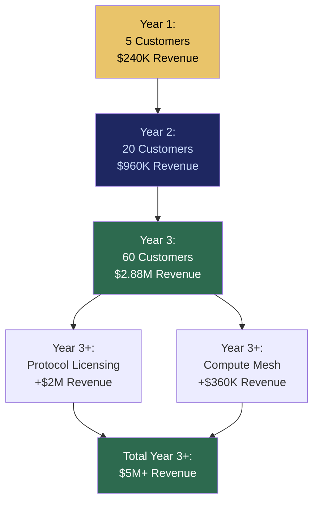

# EOL: Edge Orchestration Layer

## What It Is

An outcome-based monetization engine that replaces surveillance marketing, attention capture, and ad-driven economics with measurable value delivery. EOL charges for reduced risk, reduced cost, reduced latency, and increased execution velocity — never for engagement time, data access, or attention.

In the source architecture, this is the **Economic Outcome Layer** — the mechanism that ensures revenue generation stays aligned with sovereignty principles.

---

## Purpose and Problem It Solves

| Problem | Current State | EOL Resolution |
|---|---|---|
| Surveillance marketing as default | Ad revenue model requires tracking user behavior | No ads. Revenue tied to measurable outcomes |
| Attention economy misalignment | Platforms profit from time-on-site, not user outcomes | Monetization indexed to cost savings, risk reduction |
| Data-as-product | User data sold to advertisers | User data is encrypted signal; never commoditized |
| Engagement optimization | Dark patterns maximize session length | No engagement metrics in revenue model |
| Price opacity | Cloud and SaaS pricing obscures true cost | Transparent outcome-based pricing with visible methodology |

---

## Technical Specification

### Revenue Models

| Model | Mechanism | Typical Revenue | Margin |
|---|---|---|---|
| Enterprise subscription | $3,000-$5,000/month for sovereign runtime + support | $48,000/year per enterprise | ~46% |
| Outcome kicker | 10-20% of measured cost savings | Variable per deployment | ~70% |
| Compute leasing | 30% platform share of idle compute revenue | ~$7,200/year per node | ~85% |
| Protocol licensing | Certification + compatibility validation | $100K/year per vendor | 70-85% |
| Compliance automation | Cryptographic audit log infrastructure | Bundled with subscription | Included |

### Inputs

| Input | Description |
|---|---|
| Baseline cost profile | Customer's current infrastructure spend before deployment |
| Outcome measurements | Post-deployment cost, performance, risk metrics |
| Subscription configuration | Tier, features, SLA level |
| Compute marketplace data | Revenue from idle compute leasing |
| Licensing agreements | Vendor protocol certification terms |

### Outputs

| Output | Description |
|---|---|
| Invoice | Transparent breakdown: subscription + outcome share |
| Savings report | Documented cost reduction with methodology |
| Revenue dashboard | Real-time revenue per customer, per model |
| Unit economics report | CAC, LTV, margin per segment |

### Key Interfaces

```
EOL.setBaseline(customerID, costProfile) → BaselineConfiguration
EOL.measureOutcome(customerID, period) → OutcomeReport
EOL.calculateFee(baselineID, outcomeReport) → InvoiceBreakdown
EOL.projectRevenue(customerBase, growthRate) → RevenueProjection
EOL.getUnitEconomics(customerID) → UnitEconomicsReport
```

---

## Revenue Scaling Model



### Unit Economics Per Enterprise

| Item | Annual |
|---|---|
| Revenue | $48,000 |
| CAC (amortized over 3 years) | -$4,000 |
| Support + ops | -$10,000 |
| Infrastructure overhead | -$2,000 |
| R&D allocation (20%) | -$9,600 |
| **Net contribution** | **$22,400** |
| **Gross margin** | **~46%** |

---

## Integration Points

| Component | Integration |
|---|---|
| **ESR** | Deployment cost and performance data feeds outcome measurement |
| **IOO** | Execution metrics provide savings/performance deltas |
| **SCM** | Compute leasing revenue flows through EOL |
| **CE** | Compliance automation revenue bundled with subscriptions |
| **GPL** | Pricing policies subject to governance transparency |
| **SCP** | Revenue growth cannot override sovereignty constraints |
| **ORF** | Financial obligations tracked through ORF lifecycle |

---

## Implementation Priority

**Phase 1 — Years 0-1 (Survive & Prove)**

EOL is an **L3 (Enterprise)** deliverable. Revenue model is active from first customer.

- Month 1-6: Subscription pricing for Secure Legal AI Node ($3,000-$5,000/month)
- Month 6-12: Baseline measurement and savings calculation for first customers
- Month 12-18: Outcome kicker model (base subscription + savings share)
- Month 24-36: Protocol licensing and compute marketplace revenue streams

---

## Constraints

- Revenue must never be tied to engagement, attention, or session length.
- No user data monetization. No data resale. No surveillance economics.
- Pricing methodology must be transparent to customers.
- Outcome measurements must be verifiable by customer (no black-box savings claims).
- Revenue growth cannot override sovereignty constraints (SCP enforcement).
- No dynamic token speculation. Payments in fiat or stable-value denominations.

---

## Anti-Patterns (Explicitly Prohibited)

| Anti-Pattern | Why Prohibited |
|---|---|
| Ad-based revenue | Corrupts discovery; creates surveillance dependency |
| Data resale | Violates sovereignty principles |
| Engagement optimization | Misaligns platform with user outcomes |
| Dark patterns | Erodes trust; creates regulatory risk |
| Pay-to-rank in CGE | Corrupts evaluation integrity |
| Token speculation | Creates speculative volatility unrelated to value |

---

## User Level Access

| Level | Profile | EOL Capability |
|---|---|---|
| L1 | Everyday Individual | Consumer pricing (future phase) |
| L2 | Power User / Builder | Subscription management |
| L3 | Enterprise Node | Full outcome-based pricing with savings tracking |
| L4 | Network Operator | Revenue dashboard, marketplace economics |
| L5 | Protocol Steward | Economic policy governance |

---

## Related Deliverables

- [SCM — Sovereign Compute Marketplace](./10-scm)
- [IOO — Intent Outcome Oracle](./08-ioo)
- [CE — Compliance Engine](./15-ce)
- [GPL — Governance Policy Language](./12-gpl)
- [SCP — Sovereign Compute Protocol](./20-scp)
