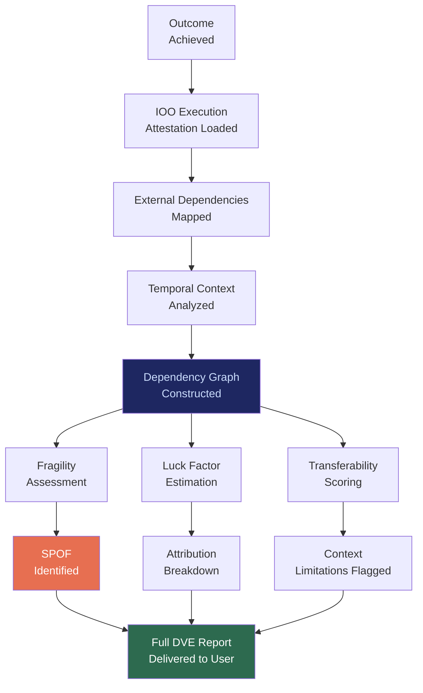

# DVE: Distributed Verification Engine

## What It Is

A post-outcome verification engine that surfaces hidden dependencies — invisible constraints, timing factors, platform reliance, external leverage sources, and luck — that contributed to any result. DVE prevents false mastery by ensuring users understand **why** an outcome occurred, not just **that** it occurred.

In the source architecture, this is the **Dependency Visibility Engine** — the mechanism that prevents delusion, myth-building, and overfit abstractions.

---

## Purpose and Problem It Solves

| Problem | Current State | DVE Resolution |
|---|---|---|
| False mastery after success | Users attribute outcomes to skill alone | Dependency graph surfaces timing, luck, platform factors |
| Overfit pattern replication | Success patterns applied without context | Transferability stress testing before abstraction |
| Founder delusion | Narrative capture replaces structural understanding | Mandatory dependency surfacing after major outcomes |
| Hidden fragility | Outcomes rest on invisible single points of failure | SPOF detection and fragility mapping |
| Pattern leeches | Operators copy optics without understanding structure | Structure-level transparency prevents surface-level copying |

---

## Technical Specification

### Inputs

| Input | Description |
|---|---|
| Execution attestation | Full record of what happened during outcome (from IOO) |
| External dependency log | APIs, services, platforms, and markets used |
| Temporal context | Market conditions, timing factors, regulatory environment |
| Comparison baseline | Counterfactual scenarios (what if X was different?) |
| Historical patterns | Previous similar executions and their dependency profiles |

### Outputs

| Output | Description |
|---|---|
| Dependency graph | Visual map of all factors contributing to outcome |
| Fragility assessment | Single points of failure and concentration risk |
| Transferability score | Likelihood that outcome pattern works in different context |
| Luck factor estimate | Proportion of outcome attributable to timing/market/circumstance |
| Counterfactual analysis | What would have happened under different conditions |

### Key Interfaces

```
DVE.analyzeDependencies(executionID) → DependencyGraph
DVE.assessFragility(dependencyGraph) → FragilityReport
DVE.testTransferability(pattern, newContext) → TransferabilityScore
DVE.estimateLuckFactor(executionID, historicalData) → LuckEstimate
DVE.runCounterfactual(executionID, altScenarios) → CounterfactualResults
DVE.verifyIntegrity(attestation) → IntegrityVerification
```

---

## Dependency Surfacing Flow



---

## Integration Points

| Component | Integration |
|---|---|
| **IOO** | Primary data source; execution attestations feed dependency analysis |
| **PFV** | DVE reports stored in user vault for longitudinal pattern tracking |
| **CGE** | Solution selection dependencies surfaced post-execution |
| **CE** | DVE reports trigger compliance review for high-risk dependencies |
| **GPL** | Dependency transparency enforced by governance policy |
| **CUXF** | DVE reports presented through agency-aligned UX |
| **ORF** | Dependency graph attached to obligation records |

---

## Implementation Priority

**Phase 2 — Years 1-2 (Stabilize & Standardize)**

DVE is an **L3 (Enterprise Node) / Advanced User** deliverable.

- Month 12-18: Basic dependency graph generation from IOO execution attestations
- Month 18-24: Fragility assessment and SPOF detection
- Month 24-30: Luck factor estimation and transferability scoring
- Month 30-36: Counterfactual analysis engine
- First use case: Post-deployment analysis showing enterprise customers exactly what their AI cost savings depend on

---

## Constraints

- DVE reports are informational, not blocking. Users are not prevented from acting.
- Dependency analysis runs after outcomes, not during execution (no latency impact).
- Luck factor estimates include confidence intervals; no false precision.
- Transferability scores explicitly state context limitations.
- Reports are stored in user vault; platform cannot access them without permission.

---

## User Level Access

| Level | Profile | DVE Capability |
|---|---|---|
| L1 | Everyday Individual | Not enabled |
| L2 | Power User / Builder | Basic dependency graph |
| L3 | Enterprise Node | Full analysis with fragility + luck + transferability |
| L4 | Network Operator | Cross-organization dependency mapping |
| L5 | Protocol Steward | Verification methodology governance |

---

## Related Deliverables

- [IOO — Intent Outcome Oracle](./08-ioo)
- [PFV — Personal Fabric Vault](./03-pfv)
- [CGE — Computational Governance Engine](./06-cge)
- [CE — Compliance Engine](./15-ce)
- [CUXF — Civilizational UX Framework](./18-cuxf)
