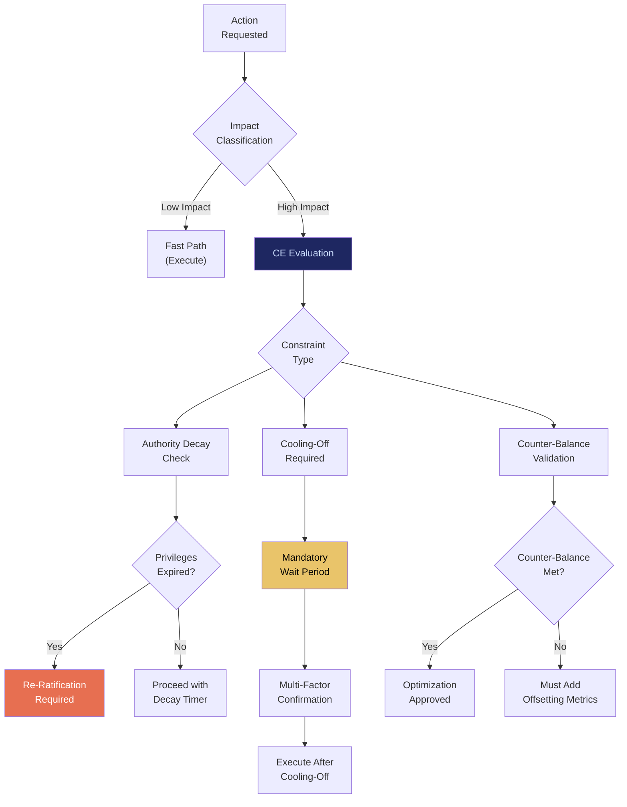

# CE: Compliance Engine

## What It Is

A constraint enforcement system that implements time-bound authority decay, cooling-off periods for irreversible actions, and mandatory friction for high-impact operations. CE ensures that **all power expires unless explicitly renewed** — no permanent privilege grants, no silent authority accumulation, no leverage without constraint.

In the source architecture, this is the **Constraint Engine** — the structural brake that prevents the Sovereign Intent Fabric from becoming the authoritarian system it exists to replace.

---

## Purpose and Problem It Solves

| Problem | Current State | CE Resolution |
|---|---|---|
| Permanent admin privileges | Enterprise admins retain omnipotent access indefinitely | Automatic privilege decay with re-ratification requirement |
| Impulsive irreversible actions | One-click deployments affecting thousands | Cooling-off periods + multi-factor intent confirmation for high-impact ops |
| Silent leverage escalation | Users accumulate scope without governance checkpoints | Periodic privilege audits with mandatory justification |
| Metric-driven corruption (Goodhart) | KPI optimization replaces actual value | Counter-balancing metric requirements; no single-scalar governance |
| No power brake at system level | Platforms accelerate without structural restraint | CE enforces constraint at identity, intent, execution, economics, and governance layers |

---

## Technical Specification

### Constraint Types

| Constraint | Layer | Mechanism | Default |
|---|---|---|---|
| Authority decay | Identity (SIP) | Privilege expiration + re-ratification | 90-day max elevation |
| Cooling-off period | Intent (IDE/IOO) | Enforced delay for irreversible actions | 24 hours for capital movement |
| Resource caps | Execution (ESR) | Hard limits on compute per agent | Per SACS contract |
| Anti-Goodhart | Economics (EOL) | Mandatory counter-balancing metrics | Minimum 3 dimensions |
| Governance expiry | Governance (GPL) | Policy re-ratification requirements | 12-month max policy life |
| Agent scope lock | Agents (SACS) | No self-modification of contracts | Always enforced |
| UX anti-addiction | Interface (CUXF) | No infinite scroll, no engagement loops | Always enforced |

### Inputs

| Input | Description |
|---|---|
| Privilege elevation request | Request to increase authority scope |
| High-impact operation declaration | Action flagged as irreversible or high-impact |
| Metric optimization proposal | KPI change request requiring counter-balance check |
| Governance change proposal | Policy modification requiring constraint review |
| Agent contract modification | Scope change request for active agent |

### Outputs

| Output | Description |
|---|---|
| Constraint enforcement decision | Approved, delayed (cooling-off), or denied |
| Authority decay schedule | When current privileges expire |
| Cooling-off timer | Countdown to execution for delayed operations |
| Audit trail | Immutable record of all constraint decisions |
| Counter-balance report | Required offsetting metrics for optimization proposals |

### Key Interfaces

```
CE.evaluateConstraint(action, context) → ConstraintDecision
CE.enforceDecay(sipToken, privilegeScope) → DecaySchedule
CE.startCoolingOff(operationID, duration) → CoolingOffTimer
CE.validateCounterBalance(metrics, optimization) → CounterBalanceReport
CE.auditPrivileges(sipToken) → PrivilegeAuditReport
CE.overrideConstraint(sipToken, justification, quorum) → OverrideDecision
```

---

## Constraint Architecture



---

## Constraint Application Across SIF Layers

| Layer | Constraint Applied | Why |
|---|---|---|
| Identity | Authority decay | Phase IV competence inertia → authoritarian drift |
| Intent | Cooling-off for irreversible actions | Prevent impulse-driven harm at scale |
| Execution | Agent scope locks, resource caps | Prevent silent leverage escalation |
| Economics | Anti-Goodhart counter-balancing | Metrics replace reality without constraint |
| Governance | Policy expiry, re-ratification | Governance fossilization without renewal |
| UX | Anti-addiction design | Engagement optimization erodes agency |
| Lifecycle | Orphan-proofing (via OPGM) | Systems must survive creator absence |

---

## Integration Points

| Component | Integration |
|---|---|
| **SIP** | Authority decay enforced on privilege elevations |
| **SACS** | Agent contract scope locks and resource caps |
| **IOO** | Cooling-off triggers for high-impact executions |
| **ESR** | Resource limit enforcement at container level |
| **GPL** | Governance policy expiry and re-ratification |
| **EOL** | Revenue model constraint (no surveillance economics) |
| **CUXF** | Anti-addiction UX constraints |
| **OPGM** | Founder authority decay integration |
| **SCP** | System-level stop conditions |
| **ORF** | Constraint decisions create tracked obligations |
| **MCO** | All constraints have defined lifecycle and expiry |

---

## Implementation Priority

**Phase 1 — Years 0-1 (Survive & Prove)**

CE is part of the non-negotiable nucleus: `SIP + ESR + SACS + CE`.

- Month 3-6: Manual constraint definitions (written operational policy)
- Month 6-9: Authority decay timers on SIP privilege elevations
- Month 9-12: Cooling-off periods for high-impact agent operations
- Month 12-18: Anti-Goodhart counter-balance validation
- First deployment: Constraint policy for law firm sovereign nodes (no root escalation, no background telemetry, no auto-start external connections)

---

## Constraints (Meta)

CE itself is subject to governance:
- Constraint rules can be updated via GPL governance process.
- Override requires multi-party quorum with mandatory justification.
- All override decisions are logged and auditable.
- CE cannot be disabled at the system level; only individual constraints can be modified.

---

## User Level Access

| Level | Profile | CE Capability |
|---|---|---|
| L1 | Everyday Individual | Subject to constraints (read access to own decay schedules) |
| L2 | Power User / Builder | View and understand constraint decisions |
| L3 | Enterprise Node | Configure constraint parameters within policy bounds |
| L4 | Network Operator | Constraint policy management |
| L5 | Protocol Steward | Constraint framework governance (decaying authority) |

---

## Related Deliverables

- [SIP — Sovereign Identity Primitive](./01-sip)
- [SACS — Sovereign Agent Coordination System](./05-sacs)
- [GPL — Governance Policy Language](./12-gpl)
- [OPGM — Open Protocol Governance Model](./19-opgm)
- [SCP — Sovereign Compute Protocol](./20-scp)
