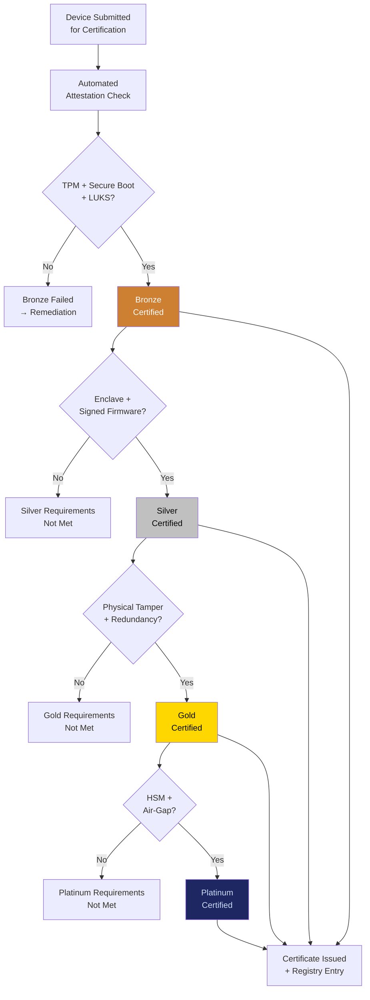

# EDCS: Edge Data Classification System

## What It Is

A hardware compliance and certification program that defines what qualifies as a sovereign-grade edge node. EDCS specifies minimum requirements for TPM, secure boot, enclave support, firmware integrity, and physical tamper resistance — creating a verifiable standard that enterprises can trust for on-premises deployment.

In the source architecture, this is the **Edge Device Certification Standard** — the mechanism that ensures ESR runs on hardware that deserves sovereignty claims.

---

## Purpose and Problem It Solves

| Problem | Current State | EDCS Resolution |
|---|---|---|
| No edge sovereignty standard | Any hardware claims to be "secure" without verification | Structured certification with attestation proofs |
| Consumer hardware masquerading as enterprise | Off-shelf laptops deployed for sensitive workloads | Minimum specs for TPM 2.0, secure boot, enclave support |
| Supply chain firmware risk | Firmware tampering invisible to OS | Measured boot + firmware integrity verification |
| No trust basis for compute sharing | SCM requires hardware trust; no verification exists | EDCS attestation required for SCM participation |
| Enterprise procurement confusion | IT teams lack clear criteria for sovereign edge hardware | Published standard with certified device list |

---

## Technical Specification

### Certification Requirements

| Requirement | Minimum Standard | Verification Method |
|---|---|---|
| TPM | 2.0 (discrete or firmware) | TPM attestation key verification |
| Secure Boot | UEFI Secure Boot enabled | Boot chain measurement |
| Disk Encryption | LUKS or equivalent full-disk encryption | Encryption state attestation |
| Enclave Support | Intel SGX, AMD SEV, or ARM TrustZone | Enclave attestation report |
| Firmware Integrity | Signed firmware with rollback protection | Firmware hash verification |
| Physical Tamper | Tamper-evident chassis (enterprise tier) | Physical inspection + seal verification |
| Network Isolation | Firewall with default-deny policy | Configuration audit |
| Container Runtime | Rootless container support | Runtime capability check |

### Certification Tiers

| Tier | Requirements | Use Case |
|---|---|---|
| **Bronze** | TPM 2.0 + Secure Boot + LUKS | Personal sovereign node |
| **Silver** | Bronze + Enclave + Signed firmware | Small enterprise deployment |
| **Gold** | Silver + Physical tamper evidence + Redundant power | Enterprise production node |
| **Platinum** | Gold + Hardware security module (HSM) + Air-gap capability | Regulated industry / government |

### Inputs

| Input | Description |
|---|---|
| Hardware attestation report | TPM and enclave attestation from device |
| Firmware manifest | Signed firmware versions and hashes |
| Configuration audit | Firewall, encryption, runtime settings |
| Physical inspection report (Gold+) | Tamper seal and chassis integrity |

### Outputs

| Output | Description |
|---|---|
| Certification certificate | Signed proof of compliance at specific tier |
| Device registry entry | Listed in certified device database |
| Compliance expiry date | When re-certification is required |
| Deficiency report | What failed and remediation steps |

### Key Interfaces

```
EDCS.submitForCertification(hardwareAttestation, tier) → CertificationRequest
EDCS.evaluateCompliance(requestID) → ComplianceReport
EDCS.issueCertificate(requestID) → CertificationCertificate
EDCS.verifyCertificate(certificateID) → VerificationResult
EDCS.listCertifiedDevices(tier) → DeviceRegistry
EDCS.scheduleRecertification(certificateID) → RecertificationSchedule
```

---

## Certification Flow



---

## Integration Points

| Component | Integration |
|---|---|
| **ESR** | EDCS certification required for production ESR node deployment |
| **SCM** | EDCS attestation required for compute marketplace participation |
| **SIP** | Hardware attestation chain anchored to SIP identity |
| **PQCS** | Certification verifies post-quantum algorithm support |
| **CE** | Certification has enforced expiry; annual re-certification required |
| **GPL** | Certification standards governed by GPL policy framework |
| **ORF** | Certification creates trackable compliance obligation |

---

## Implementation Priority

**Phase 2-3 — Years 2-3 (Stabilize & Scale)**

EDCS is an **L4 (Network Operator)** deliverable. It matters when hardware diversity increases.

- Month 18-24: Bronze/Silver certification for existing enterprise deployments
- Month 24-30: Gold certification with physical tamper requirements
- Month 30-36: Published standard with certified device list
- Longer term: Platinum tier for regulated industries, OEM partnership program

---

## Constraints

- Certification has enforced expiry (12 months); hardware must be re-certified annually.
- Do not begin manufacturing devices. Certify existing hardware first.
- Certification standards must be transparent and publicly auditable.
- No pay-to-certify fast-track that bypasses requirements.
- Firmware updates require re-attestation of the changed components.

---

## User Level Access

| Level | Profile | EDCS Capability |
|---|---|---|
| L1 | Everyday Individual | Check if personal device meets Bronze |
| L2 | Power User / Builder | Self-certification for personal nodes |
| L3 | Enterprise Node | Organizational fleet certification management |
| L4 | Network Operator | Certification program administration |
| L5 | Protocol Steward | Certification standard governance |

---

## Related Deliverables

- [ESR — Edge Sovereignty Runtime](./02-esr)
- [SCM — Sovereign Compute Marketplace](./10-scm)
- [SIP — Sovereign Identity Primitive](./01-sip)
- [PQCS — Post-Quantum Cryptographic Suite](./11-pqcs)
- [CE — Compliance Engine](./15-ce)
