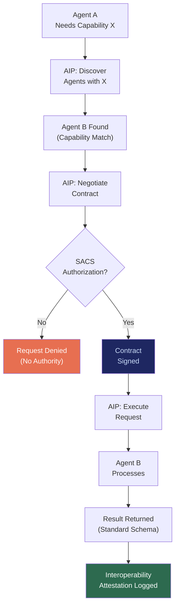

# AIP: Agent Interoperability Protocol

## What It Is

A universal agent communication grammar that defines how AI agents discover each other's capabilities, negotiate execution contracts, exchange data, and coordinate across organizational and ecosystem boundaries. AIP prevents the fragmentation that occurs when every AI vendor creates its own proprietary agent communication format.

AIP is the **interoperability primitive** of the Sovereign Intent Fabric. Without it, every agent ecosystem becomes a silo — and the entire SIF stack devolves into another walled garden.

---

## Purpose and Problem It Solves

| Problem | Current State | AIP Resolution |
|---|---|---|
| API fragmentation | Every AI vendor has proprietary agent communication | Standardized capability advertisement + intent contracts |
| Vendor lock-in through agents | Agent workflows tied to specific platforms | Portable execution descriptors; vendor-agnostic |
| No cross-ecosystem coordination | OpenAI agents cannot coordinate with Anthropic agents | Universal grammar that any agent can implement |
| Siloed AI ecosystems | Enterprise A's agents cannot talk to Enterprise B's agents | Cross-organization agent communication with SACS-enforced boundaries |
| Protocol standard competition | MCP, LangChain, AutoGPT each define incompatible interfaces | AIP as abstraction layer over existing protocols |

---

## Technical Specification

### Protocol Components

| Component | Function | Description |
|---|---|---|
| Capability Advertisement | Agent self-description | Structured manifest of what an agent can do |
| Intent Contract | Negotiated execution agreement | What will be done, with what data, under what constraints |
| Execution Descriptor | Portable workflow specification | Platform-agnostic description of execution steps |
| Result Schema | Standardized output format | Common data format for agent results |
| Error Grammar | Standardized failure reporting | Structured error codes with remediation hints |

### Inputs

| Input | Description |
|---|---|
| Agent capability manifest | Structured description of agent's abilities |
| Intent contract request | What the calling agent wants done |
| SACS authorization | Cryptographic proof that the calling agent is permitted to make this request |
| Data schema | Format specification for input/output data |

### Outputs

| Output | Description |
|---|---|
| Capability discovery response | Matched agents for a given intent |
| Negotiated contract | Mutually agreed execution terms |
| Execution result | Standardized output conforming to result schema |
| Interoperability attestation | Proof that communication followed AIP grammar |

### Key Interfaces

```
AIP.advertiseCapabilities(agentID, manifest) → CapabilityRegistration
AIP.discoverAgents(intent, requirements) → AgentMatch[]
AIP.negotiateContract(callerID, targetID, intent) → NegotiatedContract
AIP.executeRequest(contract, payload) → ExecutionResult
AIP.validateGrammar(message) → GrammarValidation
AIP.translateProtocol(sourceFormat, targetFormat, message) → TranslatedMessage
```

### Message Schema

```
{
  "protocol": "AIP/1.0",
  "sender": "<SIP Token>",
  "receiver": "<SIP Token>",
  "intent": "<Structured Intent Object>",
  "authorization": "<SACS Contract Reference>",
  "payload": "<Encrypted Data>",
  "constraints": {
    "maxDuration": "<seconds>",
    "maxCost": "<amount>",
    "dataScope": "<allowed paths>"
  },
  "resultSchema": "<Expected Output Format>"
}
```

---

## Communication Flow



---

## Integration Points

| Component | Integration |
|---|---|
| **SACS** | All inter-agent communication authorized via scoped contracts |
| **SIP** | Agent identities verified through sovereign identity tokens |
| **ESR** | Agent execution happens in ESR containers; AIP handles communication |
| **IOO** | Multi-agent orchestration uses AIP for agent-to-agent coordination |
| **CGE** | Agent capabilities registered in capability landscape |
| **GPL** | Interoperability standards governed by GPL framework |
| **PQCS** | Inter-agent communication encrypted with post-quantum algorithms |
| **ORF** | Inter-agent agreements tracked as obligations |

---

## Implementation Priority

**Phase 2-3 — Years 2-3 (Stabilize & Scale)**

AIP is an **L4 (Network Operator)** deliverable. It matters when cross-organization agent coordination begins.

- Month 18-24: Internal agent communication standard for enterprise deployments
- Month 24-30: Cross-organization agent discovery and contract negotiation
- Month 30-36: Published SDK for third-party agent integration
- Longer term: Protocol translation layer for MCP, LangChain, and other agent frameworks

---

## Constraints

- All inter-agent communication must be authorized via SACS. No unauthenticated agent calls.
- Agent capability advertisements must be verifiable, not self-reported marketing.
- AIP does not replace existing protocols; it provides translation and standardization.
- No centralized agent registry monopoly. Multiple registries can operate.
- Execution descriptors must be portable across platforms.
- All communication encrypted via PQCS.

---

## User Level Access

| Level | Profile | AIP Capability |
|---|---|---|
| L1 | Everyday Individual | Transparent (agents communicate on user's behalf) |
| L2 | Power User / Builder | Custom agent communication configuration |
| L3 | Enterprise Node | Cross-organization agent coordination |
| L4 | Network Operator | Agent registry management, protocol governance |
| L5 | Protocol Steward | AIP specification governance |

---

## Related Deliverables

- [SACS — Sovereign Agent Coordination System](./05-sacs)
- [SIP — Sovereign Identity Primitive](./01-sip)
- [IOO — Intent Outcome Oracle](./08-ioo)
- [CGE — Computational Governance Engine](./06-cge)
- [GPL — Governance Policy Language](./12-gpl)
