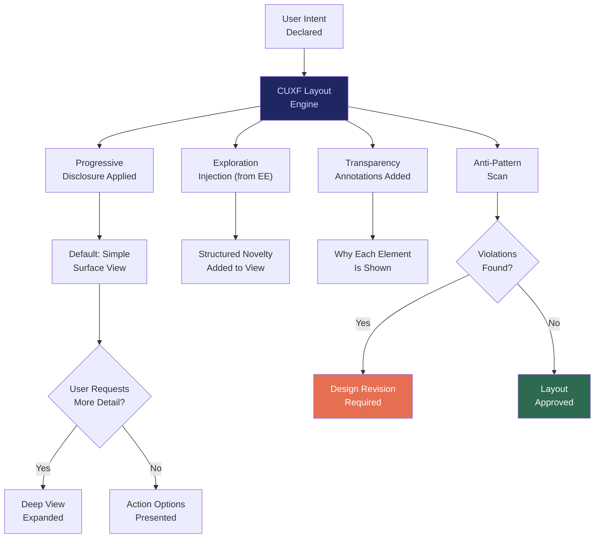

# CUXF: Civilizational UX Framework

## What It Is

An intent-aligned, non-addictive interface design framework that treats UX as a structural constraint on power, not a lever for engagement capture. CUXF defines principles, patterns, and anti-patterns for building interfaces that amplify human agency instead of exploiting attention. No infinite scroll. No variable reward loops. No engagement-based ranking. No dark patterns.

CUXF is the **cognitive protection layer** of the Sovereign Intent Fabric. It ensures the entire SIF stack — from IDE to IOO to CGE — presents information in ways that expand user capability rather than manufacture dependency.

---

## Purpose and Problem It Solves

| Problem | Current State | CUXF Resolution |
|---|---|---|
| Addictive UX patterns | Infinite scroll, variable rewards, engagement loops | Structural prohibition of addiction mechanisms |
| Attention as commodity | Platforms design for time-on-site, not user outcomes | Intent-based flow; no engagement metrics |
| Dopamine-driven discovery | Feeds narrow possibility through reinforcement | Guided exploration with cognitive expansion as goal |
| Information overwhelm | Too much data, not enough clarity | Progressive disclosure: simple surface, deep on demand |
| Loss of agency | System makes decisions user doesn't understand | Transparent decision logic with mandatory override access |

---

## Technical Specification

### Design Principles

| Principle | Implementation | Violation = |
|---|---|---|
| Intent-first flow | Every screen starts from user's declared intent | No browsing without purpose |
| Progressive disclosure | Default: simple. On demand: full detail | Never overwhelm by default |
| Agency preservation | All automated decisions show reasoning + override | No black-box automation |
| Anti-addiction | No infinite scroll, no variable rewards, no notification bombardment | Hard prohibition in component library |
| Exploration support | Structured novelty injection (from EE) | Never tunnel vision |
| Cognitive load budget | Maximum decision points per screen | UX review threshold |
| Transparency | Show why something is shown, ranked, or suggested | No opaque recommendations |

### UX Anti-Patterns (Explicitly Prohibited)

| Anti-Pattern | Why Prohibited | Enforcement |
|---|---|---|
| Infinite scroll | Creates compulsive consumption | Component library excludes it |
| Variable reward schedules | Manufactures dopamine dependency | Design review gate |
| Engagement-based ranking | Optimizes for attention, not outcomes | CGE scoring uses outcome metrics |
| Dark patterns (confirm-shaming, hidden costs) | Erodes trust and agency | Automated pattern detection |
| Notification bombardment | Fragments attention | Maximum notification frequency enforced |
| Autoplaying content | Bypasses user intent | Explicit user initiation required |
| Progress bars that manipulate urgency | Creates artificial scarcity | Honest progress reporting only |

### Inputs

| Input | Description |
|---|---|
| User intent context | Current declared intent from IDE |
| Cognitive load profile | User's configured complexity preference |
| Exploration signals | Novelty injection candidates from EE |
| Decision log | History of what user has already reviewed |
| Accessibility requirements | Visual, motor, cognitive accessibility needs |

### Outputs

| Output | Description |
|---|---|
| Interface rendering | Screens that follow CUXF principles |
| Transparency annotations | Why each element is shown |
| Override access points | Clearly marked manual control surfaces |
| Cognitive load audit | Per-screen decision point count and complexity score |

### Key Interfaces

```
CUXF.renderIntent(intentContext, profile) → InterfaceLayout
CUXF.annotateTransparency(layout) → AnnotatedLayout
CUXF.auditCognitiveLoad(layout) → CognitiveLoadReport
CUXF.validateAntiPatterns(layout) → AntiPatternReport
CUXF.injectExploration(layout, explorationSet) → EnrichedLayout
```

---

## Interface Architecture



### Reels vs. CUXF: Structural Comparison

| Dimension | Reels / Engagement UX | CUXF |
|---|---|---|
| Goal | Maximize time-on-site | Maximize user capability |
| Flow | Algorithm-led, passive consumption | Intent-led, active exploration |
| Novelty | Micro-novelty (same genre variants) | Structural novelty (new domains) |
| Feedback | Dopamine spikes per interaction | Cognitive clarity per session |
| Revenue model | Attention monetization | Outcome monetization |
| Exit design | Friction to leave | Clean exit; no guilt patterns |

---

## Integration Points

| Component | Integration |
|---|---|
| **IDE** | Intent clarification presented through CUXF principles |
| **CGE** | Landscape visualization follows progressive disclosure |
| **EE** | Exploration candidates injected into CUXF layouts |
| **IOO** | Execution monitoring dashboards follow agency-aligned design |
| **DVE** | Dependency reports presented through CUXF transparency patterns |
| **CE** | Anti-addiction constraints enforced as CUXF design rules |
| **GPL** | UX standards subject to governance audit |

---

## Implementation Priority

**Phase 1 — Years 0-1 (Survive & Prove)**

CUXF is an **L1 (Everyday Individual)** deliverable — part of the first user-facing set: `SIP, PFV, IDE, CUXF`.

- Month 3-6: Core design principles documented and component library started
- Month 6-9: Anti-pattern scanner for design review
- Month 9-12: First production interfaces for law firm deployment following CUXF
- Month 12-18: Cognitive load auditing and progressive disclosure patterns
- First deployment: Law firm AI assistant interface — intent-first, no infinite scroll, transparent reasoning

---

## Constraints

- CUXF anti-patterns are hard prohibitions, not guidelines. They are enforced in the component library.
- No engagement metrics (time-on-site, session length) may be used for UX optimization.
- All automated recommendations must include visible reasoning.
- User override must be accessible within 1 interaction from any automated decision.
- Notification frequency has a hard maximum (configurable per user, enforced by system).

---

## User Level Access

| Level | Profile | CUXF Capability |
|---|---|---|
| L1 | Everyday Individual | Full CUXF experience (default) |
| L2 | Power User / Builder | CUXF customization (complexity preferences) |
| L3 | Enterprise Node | Organizational CUXF policy configuration |
| L4 | Network Operator | CUXF standard management across deployments |
| L5 | Protocol Steward | UX framework governance |

---

## Related Deliverables

- [IDE — Intent Discovery Engine](./07-ide)
- [EE — Exploration Engine](./09-ee)
- [CGE — Computational Governance Engine](./06-cge)
- [CE — Compliance Engine](./15-ce)
- [DVE — Distributed Verification Engine](./14-dve)
