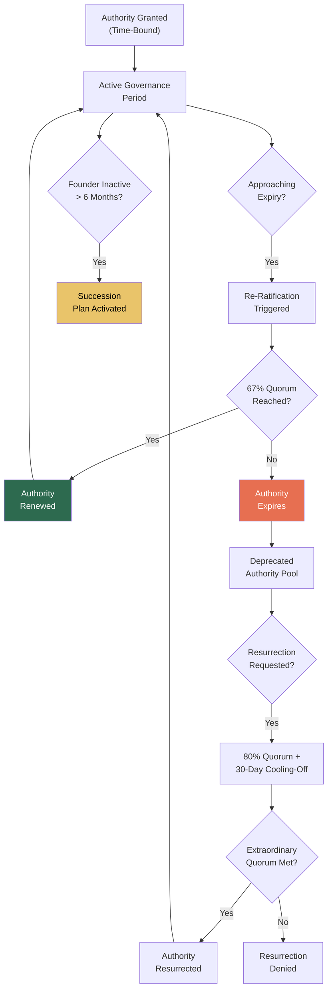

# OPGM: Open Protocol Governance Model

## What It Is

A governance architecture that enforces **founder authority decay** and ensures the Sovereign Intent Fabric survives the absence, irrelevance, or death of its creators. OPGM makes authority mortal — governance power expires without re-consensus, resurrection of deprecated control requires high quorum, and no permanent backdoor keys exist.

In the source architecture, this is the **Orphan-Proofing Governance Model** — the mechanism that prevents the SIF from becoming a personality cult disguised as infrastructure.

---

## Purpose and Problem It Solves

| Problem | Current State | OPGM Resolution |
|---|---|---|
| Founder centralization | Protocol creators retain permanent control | Authority decay: governance power expires unless renewed |
| Single-person dependency | System collapses when founder leaves | Survivability architecture: system runs without any individual |
| Hidden override keys | Backdoor access for "emergencies" | No permanent backdoors; override requires high quorum |
| Governance fossilization | Rules set at founding never updated | Mandatory re-ratification cycles |
| Power resurrection | Deprecated authority restored unilaterally | Resurrection requires extraordinary quorum + cooling-off |

---

## Technical Specification

### Authority Decay Rules

| Rule | Parameter | Default |
|---|---|---|
| Maximum authority grant duration | Time before automatic expiry | 12 months |
| Re-ratification quorum | Votes needed to renew authority | 67% of active stakeholders |
| Resurrection quorum | Votes to restore deprecated authority | 80% + 30-day cooling-off |
| Founder authority class | Maximum privilege level over time | Decays from L5 to L3 after 24 months |
| Emergency override | Temporary authority grant for crisis | 48-hour max, multi-party approval |
| Succession trigger | What activates successor governance | Founder inactivity > 6 months |

### Inputs

| Input | Description |
|---|---|
| Current authority grants | Active governance privileges across all identities |
| Re-ratification request | Proposal to renew expiring authority |
| Resurrection request | Proposal to restore deprecated authority |
| Succession event | Founder absence, incapacity, or death |
| Stakeholder registry | Active participants with voting rights |

### Outputs

| Output | Description |
|---|---|
| Authority decay schedule | Timeline of expiring governance grants |
| Re-ratification result | Approved or denied with vote record |
| Succession plan activation | Transfer of governance functions |
| Authority audit trail | Complete history of governance grants, renewals, and expirations |

### Key Interfaces

```
OPGM.getDecaySchedule(sipToken) → DecaySchedule
OPGM.requestReRatification(sipToken, scope) → RatificationProposal
OPGM.requestResurrection(deprecated, justification) → ResurrectionProposal
OPGM.vote(proposalID, sipToken, decision) → VoteReceipt
OPGM.activateSuccession(trigger) → SuccessionPlan
OPGM.auditAuthority(scope) → AuthorityAuditTrail
OPGM.getGovernanceHealth() → GovernanceHealthReport
```

---

## Authority Decay Lifecycle



### Founder Authority Decay Timeline

| Period | Founder Authority Level | Governance Rights |
|---|---|---|
| Month 0-12 | L5 (Protocol Steward) | Full governance specification |
| Month 12-24 | L5 → L4 (decaying) | Governance management, losing specification rights |
| Month 24-36 | L4 → L3 | Operational governance only |
| Month 36+ | L3 (Enterprise Node) | Same as any enterprise participant |
| Renewal | Requires 67% quorum | Can re-elevate if community ratifies |

---

## Integration Points

| Component | Integration |
|---|---|
| **SIP** | Authority grants tied to sovereign identities |
| **CE** | Authority decay enforced by constraint engine |
| **GPL** | Governance policies subject to OPGM re-ratification rules |
| **SCP** | Stop conditions include governance health checks |
| **ITP** | Governance succession tied to identity transfer mechanisms |
| **ORF** | Governance decisions create tracked obligations |
| **MCO** | All authority grants are mortal compliance objects |

---

## Implementation Priority

**Phase 3 — Years 2-3 (Scale Discipline)**

OPGM is an **L5 (Protocol Steward)** deliverable. It becomes critical when the protocol has an installed base worth governing.

- Month 24-30: Authority decay schedule for founder governance grants
- Month 30-36: Re-ratification mechanism for enterprise stakeholders
- Month 36+: Full succession planning and resurrection quorum logic
- First application: Founder authority over CGE scoring methodology decays from L5 to L3 within 24 months

---

## Constraints

- No permanent authority grants. All governance power has enforced expiry.
- No hidden override keys. Emergency access requires multi-party approval and is time-limited.
- Resurrection of deprecated authority is deliberately expensive (80% quorum + cooling-off).
- Founder authority decays whether or not the founder agrees. This is protocol-level, not discretionary.
- The system must function without any specific individual.
- All authority changes are immutably logged.

---

## The Hardest Constraint

OPGM embeds one constraint that most founders refuse to implement:

**The protocol designer's own authority decays by default.**

This is not a governance feature added later. It is designed into the architecture from the beginning. The test of OPGM is not whether it constrains others — it is whether it constrains the creator.

Systems that constrain users but not creators become what they claim to resist.

---

## User Level Access

| Level | Profile | OPGM Capability |
|---|---|---|
| L1 | Everyday Individual | View governance health reports |
| L2 | Power User / Builder | Participate in re-ratification votes |
| L3 | Enterprise Node | Stakeholder voting rights |
| L4 | Network Operator | Governance proposal rights |
| L5 | Protocol Steward | Governance framework specification (decaying authority) |

---

## Related Deliverables

- [CE — Compliance Engine](./15-ce)
- [GPL — Governance Policy Language](./12-gpl)
- [SCP — Sovereign Compute Protocol](./20-scp)
- [SIP — Sovereign Identity Primitive](./01-sip)
- [ITP — Intent Translation Protocol](./04-itp)
