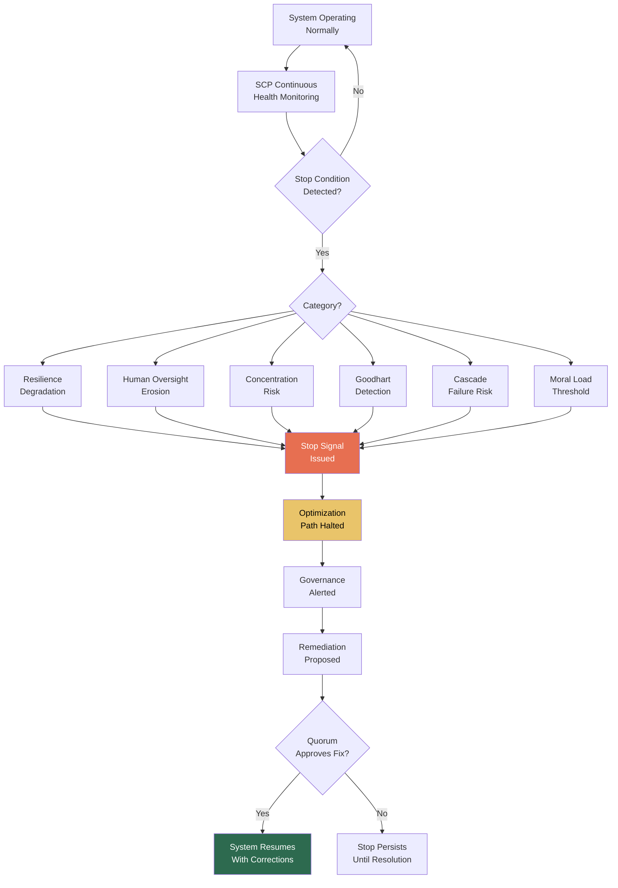

# SCP: Sovereign Compute Protocol

## What It Is

A system-level safety mechanism that defines hard-coded scenarios where the Sovereign Intent Fabric **refuses to optimize further**. SCP prevents Goodhart collapse — the point where metrics replace reality and optimization destroys the value it was designed to create. When the system detects that continued optimization would reduce long-term resilience, erode human oversight, or amplify systemic fragility, SCP triggers a stop.

In the source architecture, this is the **Stop Condition Protocol** — the grace layer that prevents the SIF from becoming pathologically self-optimizing.

---

## Purpose and Problem It Solves

| Problem | Current State | SCP Resolution |
|---|---|---|
| Goodhart collapse | "When a measure becomes a target, it ceases to be a good measure" | Hard-coded refusal when optimization degrades resilience |
| Runaway automation | Systems optimize beyond human comprehension | Stop conditions triggered when human oversight erodes |
| Systemic fragility amplification | Scale amplifies hidden failure modes | Stop when concentration risk exceeds threshold |
| Metric worship | KPIs replace actual value delivery | Multi-dimensional constraint checks, not single-metric gates |
| No system-level brake | Platforms have no mechanism to stop themselves | SCP is protocol-level, not policy-level; cannot be overridden by users |

---

## Technical Specification

### Stop Condition Categories

| Category | Trigger Condition | Response |
|---|---|---|
| Resilience degradation | Optimization reduces system diversity below threshold | Pause optimization + alert governance |
| Human oversight erosion | Automation removes human decision points below minimum | Halt automated expansion + require human review |
| Concentration risk | Single entity/node controls > X% of a critical function | Block further concentration + trigger governance review |
| Goodhart detection | Metric improvement coincides with outcome degradation | Pause optimization + surface contradiction |
| Cascade failure risk | Execution dependency chain exceeds depth threshold | Stop chaining + isolate execution segments |
| Moral load threshold | Actions with irreversible downstream effects exceed frequency | Mandatory cooling-off + human ratification |

### Inputs

| Input | Description |
|---|---|
| System health metrics | Real-time indicators across all SIF components |
| Optimization trajectory | Current direction and velocity of metric changes |
| Diversity index | Measure of system heterogeneity (providers, coordinators, nodes) |
| Human oversight ratio | Proportion of decisions involving human review |
| Dependency depth map | Current execution chain depth and concentration |
| Governance health report | Status of authority grants, quorums, and decay schedules |

### Outputs

| Output | Description |
|---|---|
| Stop signal | Protocol-level halt for specific optimization path |
| Contradiction report | What metrics improved while outcomes degraded |
| Governance alert | Notification to stakeholders requiring intervention |
| Suggested remediation | Structural changes to resolve the triggering condition |
| Stop condition log | Immutable record of all stop triggers and resolutions |

### Key Interfaces

```
SCP.evaluateHealth(systemMetrics) → HealthAssessment
SCP.checkStopConditions(optimizationTrajectory) → StopConditionResult
SCP.triggerStop(conditionID, reason) → StopSignal
SCP.resolveStop(stopID, remediation, quorum) → ResolutionConfirmation
SCP.getStopLog() → StopConditionLog
SCP.setThresholds(category, thresholds) → ThresholdConfiguration
```

---

## Stop Condition Architecture



---

## Stop Condition Thresholds (Defaults)

| Condition | Threshold | Adjustable |
|---|---|---|
| Minimum system diversity index | 0.6 (on 0-1 scale) | Yes, via GPL governance (minimum 0.4) |
| Minimum human oversight ratio | 15% of high-impact decisions | Yes, via GPL governance (minimum 5%) |
| Maximum single-entity concentration | 30% of any critical function | Yes, via GPL governance (maximum 40%) |
| Maximum execution chain depth | 5 levels of agent delegation | Yes, via GPL governance (maximum 8) |
| Goodhart detection sensitivity | 20% metric-outcome divergence | Yes, via GPL governance |
| Moral load cooling-off | 48 hours after > 10 irreversible actions/day | Yes, via GPL governance |

---

## Integration Points

| Component | Integration |
|---|---|
| **CE** | SCP is the meta-constraint that constrains constraints; CE enforces individual stop conditions |
| **OPGM** | Governance health monitored by SCP; stop triggers if governance collapses |
| **GPL** | Stop condition thresholds adjustable via governance, within hard minimums |
| **IOO** | Execution pipeline monitored for cascade failure risk |
| **SCM** | Compute marketplace monitored for concentration risk |
| **CGE** | Scoring optimization monitored for Goodhart signals |
| **EE** | Exploration budget enforcement as resilience mechanism |
| **ORF** | Stop conditions create tracked obligations requiring resolution |

---

## Implementation Priority

**Phase 3 — Years 2-3 (Scale Discipline)**

SCP is an **L5 (Protocol Steward) / System-Level** deliverable. It becomes critical when the system has enough scale to exhibit emergent pathological behavior.

- Month 24-30: Basic health monitoring and concentration risk detection
- Month 30-36: Goodhart detection (metric-outcome divergence monitoring)
- Month 36+: Full stop condition suite with governance-adjustable thresholds
- First application: Monitor CGE scoring optimization for Goodhart signals; halt if metric improvement coincides with user outcome degradation

---

## Constraints

- SCP cannot be disabled at the system level. Individual conditions can be adjusted (within hard minimums) via GPL governance.
- Stop signals cannot be overridden by any single identity, including the protocol steward.
- Resolution requires multi-stakeholder quorum and documented remediation.
- Hard minimum thresholds exist for each category; governance can loosen above the minimum but never below.
- All stop triggers and resolutions are immutably logged.

---

## Design Philosophy

SCP exists because of a fundamental insight from the source document's E2E progression framework:

> Phase V (Power Maturity) risks: Goodhart collapse. Metrics replace reality. Optimization destroys meaning.

> Phase VII (Terminal Layer): Stop Condition. You recognize when optimization becomes pathology.

SCP is the protocol-level implementation of that recognition. It is not censorship. It is not moral policing. It is **system survival** — the mechanism that prevents the Sovereign Intent Fabric from optimizing itself into the thing it was built to replace.

The hardest part of SCP is that the people who most need it will most resist it — because stop conditions feel like failure to optimization-addicted builders.

They are not failure. They are the only thing standing between infrastructure and catastrophe.

---

## User Level Access

| Level | Profile | SCP Capability |
|---|---|---|
| L1 | Everyday Individual | View system health status |
| L2 | Power User / Builder | View stop condition logs |
| L3 | Enterprise Node | Participate in remediation proposals |
| L4 | Network Operator | Threshold adjustment proposals |
| L5 | Protocol Steward | Stop condition framework governance (within hard minimums) |

---

## Related Deliverables

- [CE — Compliance Engine](./15-ce)
- [OPGM — Open Protocol Governance Model](./19-opgm)
- [GPL — Governance Policy Language](./12-gpl)
- [CGE — Computational Governance Engine](./06-cge)
- [IOO — Intent Outcome Oracle](./08-ioo)
