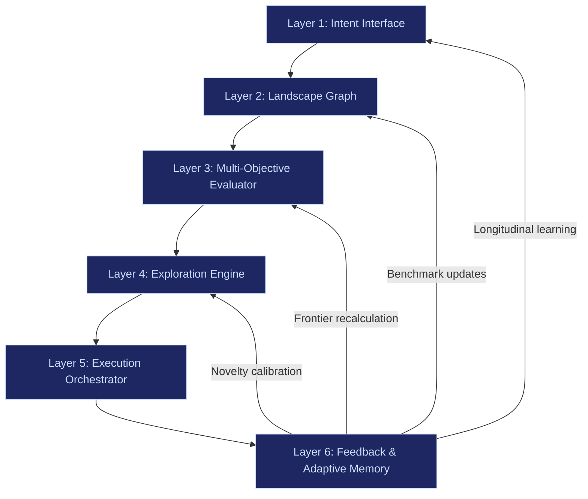

# Sovereign Intent Fabric

The Sovereign Intent Fabric (SIF) is the long-term infrastructure thesis behind the FrankMax Marketplace. It is not a product. It is not an AI OS. It is not a search engine replacement. It is a **coordination layer for civilization** — a globally interoperable, edge-first, agent-coordinated intent fabric where humans declare outcomes, agents negotiate execution, compute location is abstracted, discovery is multidimensional, exploration is preserved, power is decentralized, and friction between intention and reality is minimal.

---

## What SIF Actually Is

| Attribute | Value |
|---|---|
| **Classification** | Sovereign intent infrastructure layer |
| **Core thesis** | Collapse friction between human intent and multi-system execution |
| **Computing paradigm** | Edge-first, cloud-as-extension |
| **Discovery model** | Multidimensional capability landscapes (no ranking hierarchy) |
| **Monetization** | Outcome-based, non-ad-driven |
| **Identity model** | Hardware-rooted, post-quantum cryptographic identity |
| **Agent model** | Ephemeral, scoped, interoperable via universal protocol |
| **First vertical** | Secure Legal AI Node for mid-sized law firms |
| **Revenue target** | Y1: $250K, Y2: $1M, Y3: $3M, Y4: $5-8M |

---

## The 6-Layer Architecture

SIF is structured as a closed-loop system: intent enters at the top, execution happens in the middle, and feedback feeds back into every layer.

| Layer | Purpose |
|---|---|
| **Intent Interface** | Captures human outcomes, constraints, memory — persistent intent dialogue |
| **Landscape Graph** | Continuously updating capability topology of tools, vendors, APIs, jurisdictions |
| **Multi-Objective Evaluator** | Computes Pareto frontiers across cost, speed, compliance, risk, innovation |
| **Exploration Engine** | Injects structured novelty — emerging nodes, underexposed performers, contrarian clusters |
| **Execution Orchestrator** | Provisions infra, deploys models, routes APIs, triggers compliance — reversible by default |
| **Feedback Memory** | Tracks cost delta, performance delta, error rate, compliance friction — learns longitudinally |

---

## Why This Matters to FrankMax

FrankMax Marketplace sells AI models at 80% below provider pricing (the "burger"). The real profit lives in governance, compliance, and audit layers (the "fries"). The compounding moat is telemetry, failure libraries, and industry ontology (the "kitchen").

SIF extends this model into infrastructure-scale:

- **Burger becomes protocol**: The Universal Agent Coordination Protocol gives enterprises a standardized way to orchestrate AI — reducing the need for custom integration glue.
- **Fries become constraint layers**: The Governance Pluralism Layer, Constraint Engine, and Orphan-Proofing Model are the high-margin compliance infrastructure that enterprises pay for continuously.
- **Kitchen becomes edge telemetry**: Every deployed Sovereign Edge Node generates execution data, failure patterns, and optimization signals that compound daily across the installed base.

---

## The 20 Deliverables

SIF decomposes into 20 concrete deliverables, each with a defined user level and purpose:

| # | Deliverable | Abbreviation | Primary User Level |
|---|---|---|---|
| 1 | Sovereign Identity Primitive | SIP | Individual / Enterprise Admin |
| 2 | Edge Sovereign Runtime | ESR | Individual / Enterprise Node |
| 3 | Personal / Family Vault | PFV | Individual / Family |
| 4 | Inheritance Transfer Protocol | ITP | Family / Legal Entity |
| 5 | Scoped Agent Contract System | SACS | All users |
| 6 | Capability Graph Engine | CGE | Enterprise / Advanced Individual |
| 7 | Intent Discovery Engine | IDE | Individual / Founder |
| 8 | Intent-to-Outcome Orchestrator | IOO | Enterprise / Builder |
| 9 | Exploration Engine | EE | All users |
| 10 | Secure Compute Marketplace | SCM | Enterprise / Advanced Individual |
| 11 | Post-Quantum Crypto Stack | PQCS | All users |
| 12 | Governance Pluralism Layer | GPL | Enterprise / Network Operator |
| 13 | Economic Outcome Layer | EOL | Enterprise |
| 14 | Dependency Visibility Engine | DVE | Advanced User / Enterprise |
| 15 | Constraint Engine | CE | All users |
| 16 | Edge Device Certification Standard | EDCS | Enterprise IT / OEM |
| 17 | Agent Interoperability Protocol | AIP | Developers / Enterprises |
| 18 | Cognitive UX Framework | CUXF | All users |
| 19 | Orphan-Proofing Governance Model | OPGM | Network Layer |
| 20 | Stop Condition Protocol | SCP | System-Level |

The irreducible nucleus is **SIP + ESR + SACS + CE** — identity, edge execution, scoped delegation, and constraint. Everything else is expansion.

---

## Edge-First Thesis

The internet currently routes almost all AI capability through hyperscalers (AWS, Azure, GCP). This creates latency, ongoing cost, centralized control, data exposure, and vendor dependency.

SIF inverts this:

- **Phone** = local intelligence hub (3B-8B quantized models, NPU-aware scheduling)
- **Laptop** = expanded orchestration node (containerized agent runtime)
- **Cloud** = overflow compute (optional augmentation, not dependency)

Agents migrate fluidly between edge and cloud. Data stays local by default. Compute moves to data, not data to cloud.

---

## Sub-Pages

| Page | What It Covers |
|---|---|
| [Architecture](./architecture) | 6-layer deep dive with data flows, inputs/outputs, and component breakdown |
| [Revenue Plan](./revenue-plan) | 36-month plan, unit economics ($48K/customer/year, 46% margin), scaling scenarios |
| [User Tiers](./user-tiers) | 5-tier capability maturity model from Individual to Protocol Steward |
| [Agent Coordination Protocol](./agent-coordination-protocol) | Universal Agent Coordination Protocol — 5 sub-layers for agent interoperability |
| [Compute Marketplace](./compute-marketplace) | Edge compute leasing, enclave architecture, +$7,200/year per node economics |
| [Legal AI Node](./legal-ai-node) | Secure Legal AI Node v1 for mid-sized law firms, $36K-$50K/year |
