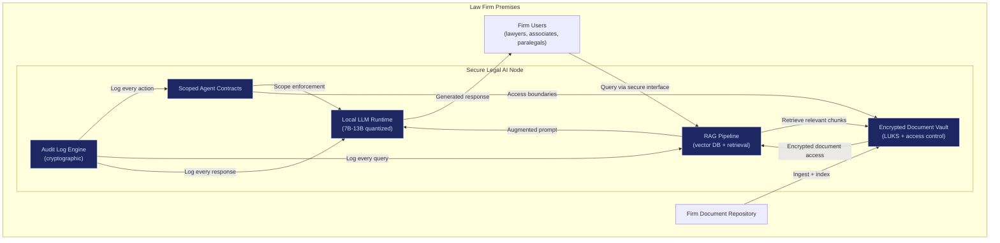

# Secure Legal AI Node

The Secure Legal AI Node v1 is the first commercial product built on the Sovereign Intent Fabric. It targets **mid-sized law firms (50-300 lawyers)** handling litigation, corporate advisory, arbitration, or regulatory matters. The product delivers confidential AI that never leaves the firm's premises — no cloud LLM APIs, no data exfiltration risk, no third-party access to client files.

This is not "legal tech." This is sovereign infrastructure deployed into the highest-confidentiality vertical available.

---

## Why Law Firms First

The vertical was selected based on four criteria: **pain intensity x budget x confidentiality sensitivity x decision speed**.

| Criterion | Score | Reasoning |
|---|---|---|
| **Pain intensity** | High | Document-intensive, repetitive review work consuming associate hours |
| **Budget** | Sufficient | Mid-size firm revenue: $2.5M-$25M+ annually; $36K-$50K/year for AI infra is realistic |
| **Confidentiality sensitivity** | Maximum | Attorney-client privilege, litigation strategy, M&A documents, arbitration filings |
| **Decision speed** | Fast | Managing partner + tech lead can decide in weeks, not months |

### Why NOT Other Verticals First

| Vertical | Rejection reason |
|---|---|
| Hospitals | Too regulated, longer sales cycles |
| Banks | 18-month procurement cycles, 10 layers of approval |
| Government | Slow, political procurement |
| Startups | No budget for enterprise-grade infrastructure |
| Manufacturing | Low immediate AI pain for document-level workflows |

### Why Law Firms Are Strategically Aligned

Law firms care about exactly what SIF delivers:

| Law firm need | SIF capability |
|---|---|
| Confidentiality | Data never leaves premises; encrypted at rest and in transit |
| Auditability | Every query and response logged with cryptographic audit trail |
| Local control | On-premises deployment; no cloud dependency |
| Client trust | Can demonstrate to clients that their data is not in third-party systems |
| Privilege preservation | AI processing happens inside the firm's trust boundary |

---

## Product Specification

### What Ships in v1

| Component | Detail |
|---|---|
| **Local LLM runtime** | On-premises inference engine running quantized models (7B-13B parameter range) |
| **Encrypted document vault** | LUKS-encrypted storage for firm documents; data at rest always encrypted |
| **RAG pipeline** | Retrieval-Augmented Generation over internal document corpus |
| **Scoped agent contracts** | Cryptographic execution boundaries — agents cannot access data outside their defined scope |
| **Audit logs** | Every query, response, document access, and agent action cryptographically logged |
| **No outbound data** | Zero network egress for client data; all processing local |

### Capabilities

| Capability | What it does | Impact |
|---|---|---|
| **Contract summarization** | Summarize lengthy contracts into structured briefs | Saves 2-4 hours per associate per contract |
| **Clause comparison** | Compare clause variants across contract versions | Reduces review errors, accelerates negotiation |
| **Legal research** | RAG-based search over internal knowledge base and precedent library | Faster case preparation |
| **Draft assistance** | Generate first drafts of standard documents (NDAs, term sheets, motions) | Frees associates for higher-value work |
| **Due diligence review** | Flag risks, inconsistencies, and missing clauses in document sets | Systematic coverage, reduced human oversight gaps |
| **Risk flagging** | Identify non-standard clauses, compliance gaps, jurisdictional issues | Early warning on deal-breakers |

### What Does NOT Ship in v1

| Excluded | Reason |
|---|---|
| Compute marketplace | Not needed for single-firm deployment |
| Inheritance protocol | Not relevant for enterprise v1 |
| Global identity narrative | Not the sales pitch — save for Phase 3+ |
| Multi-firm federation | Single-tenant only in v1 |
| Custom model training | Pre-trained models with RAG; fine-tuning is Phase 2 |

---

## Technical Architecture

### Hardware Requirements

| Component | Specification |
|---|---|
| **GPU** | 2x RTX 4090 class (or equivalent enterprise GPU) for redundancy |
| **RAM** | 128GB |
| **Storage** | Encrypted NVMe (LUKS) — sized per firm document volume |
| **Power** | Redundant power supply |
| **Network** | Internal network only; no outbound data paths for client documents |

**Hardware cost**: ~$13,000 for 2-unit redundant configuration.
**Lifecycle**: 3 years. Annualized hardware cost: ~$4,333/year.

---

## Pricing

| Model | Annual Cost | What's Included |
|---|---|---|
| **Base subscription** | $36,000-$50,000/year ($3,000-$4,200/month) | Software license, security updates, SLA, deployment support, quarterly upgrades |
| **Base + outcome kicker** | $36,000 base + 10% of measured cost savings | Aligned incentives — FrankMax earns more when the firm saves more |

### ROI Case

For a mid-sized firm with 20 associates:

| Metric | Value |
|---|---|
| Average associate billing rate | $250-$400/hour |
| Time saved per associate per week | 3-5 hours |
| Weekly value recovered | $15,000-$40,000 |
| Annual value recovered | $780,000-$2,080,000 |
| Annual SIF cost | $36,000-$50,000 |
| **ROI** | **15x-57x** |

Even at conservative estimates (2 hours saved per associate per week at $250/hour), the annual value recovered ($520,000) exceeds the subscription cost by more than 10x.

### Cost Comparison vs. Cloud LLM APIs

| Model | Annual Cost | Data Risk |
|---|---|---|
| Cloud LLM APIs (120 users, 180K queries/month) | ~$90,000 (including risk premium) | High — client data traverses external infrastructure |
| Secure Legal AI Node | ~$64,333 (hardware + subscription + ops) | Near-zero — all processing local |
| **Savings** | **~$25,667/year** | **Plus: eliminated data exfiltration risk** |

---

## Go-to-Market Plan

### Target Profile

| Attribute | Detail |
|---|---|
| **Firm size** | 50-300 lawyers |
| **Practice areas** | Litigation, corporate advisory, arbitration, regulatory, M&A |
| **Geography** | India (initial), cross-border firms (expansion) |
| **Revenue range** | $2.5M-$25M+ annually |
| **Decision makers** | Managing partner + tech lead (2-person approval chain) |

### 30-Day Tactical Plan

| Week | Activity |
|---|---|
| **Week 1-2** | Build hardened local AI legal assistant demo. Prepare on-premises deployment stack. Test with sample legal document corpus. |
| **Week 3** | Identify 10 mid-sized firms through direct network. Get meetings with managing partners. |
| **Week 4** | Deliver pilot proposal. Offer 60-day on-premises trial. No whitepapers. No philosophy deck. Demo + measurable time savings. |

### Sales Pitch

The pitch is not:
- "Rearchitect civilization."
- "Sovereign intent infrastructure."
- "Post-search paradigm."

The pitch is:

> "Confidential AI for your firm. Runs on your hardware. Client data never leaves your building. Saves 3+ hours per associate per week. $3,000/month."

### Referral Dynamics

Lawyers talk. If one litigation firm adopts secure local AI and demonstrates time savings + confidentiality, peer firms in the same city, practice area, and bar association network will learn about it through:
- Bar association events
- Co-counsel relationships
- Lateral partner moves
- Industry conferences

One successful deployment creates 3-5 warm referrals within 6 months.

---

## Revenue Projections (Law Firm Vertical)

| Timeframe | Firms Closed | Annual Revenue | Notes |
|---|---|---|---|
| Month 1-6 | 1-2 | $36K-$100K | Pilot deployments, case study generation |
| Month 6-12 | 3-5 | $108K-$250K | Referral-driven, repeatable deployment |
| Year 2 | 10-20 | $360K-$1M | Dedicated support, expanded feature set |
| Year 3 | 30-60 | $1M-$3M | Multiple geographies, adjacent verticals |

### Adjacent Verticals (Post Law Firm Validation)

Once embedded in law firms, the same deployment model extends to:

| Vertical | Why it follows | Decision speed |
|---|---|---|
| Private equity | Due diligence document review, deal confidentiality | Medium |
| Corporate compliance | Internal investigations, regulatory filings | Medium |
| Arbitration bodies | Case document management, precedent research | Medium-Fast |
| Financial services | Risk documents, regulatory reporting | Slow (but high ACV) |

---

## What This Proves for SIF

The Secure Legal AI Node is not a standalone product. It is the first validation of SIF's core physics:

| SIF Principle | How the Legal Node Proves It |
|---|---|
| Edge-first compute | All inference runs on-premises, no cloud dependency |
| Sovereign identity | Hardware-rooted access control, no passwords |
| Scoped agent contracts | Agents cannot access documents outside their defined scope |
| Audit by default | Every action cryptographically logged |
| Measurable delta | Time saved, cost reduced — quantifiable ROI |
| Enterprise-first adoption | Budget exists, pain is real, decision cycles are fast |

If the legal vertical validates, the deployment model generalizes. The node becomes the primitive. The protocol emerges from what works.
