# User Tiers

SIF users are tiered not by status or payment level — but by **capability maturity**. Each tier unlocks additional deliverables and carries additional governance responsibilities. Access expands with responsibility. Authority decays unless renewed.

---

## Tier Overview

| Tier | Profile | Enabled Deliverables | Primary Risk |
|---|---|---|---|
| **L1** | Everyday Individual | SIP, PFV, IDE, CUXF | Low leverage |
| **L2** | Power User / Builder | L1 + ESR, SACS, EE | Over-automation risk |
| **L3** | Enterprise Node | L2 + IOO, CGE, PQCS, CE | Governance drift |
| **L4** | Network Operator | L3 + GPL, AIP, EDCS | Centralization temptation |
| **L5** | Protocol Steward | L4 + OPGM, SCP | Meta-power corruption |

---

## L1: Individual

**Profile**: Everyday user. Wants control over personal data, secure identity, and clarity about their own intent. Does not run enterprise infrastructure or manage agents for others.

| Attribute | Detail |
|---|---|
| **Deliverables** | Sovereign Identity Primitive (SIP), Personal/Family Vault (PFV), Intent Discovery Engine (IDE), Cognitive UX Framework (CUXF) |
| **Capabilities** | Hardware-rooted identity, encrypted personal data vault with shard backup, reflective intent clarification, non-addictive exploration interface |
| **Pricing range** | Free tier (identity + vault basics) to $10-$30/month for full feature set |
| **Governance requirements** | Accept sovereign identity terms, manage own device keys, designate heir for inheritance protocol |
| **Primary risk** | Low leverage — limited blast radius if anything fails |

**What L1 users experience**:
- No passwords. Identity is hardware-rooted, post-quantum.
- Personal data is encrypted signal — noise to everyone else.
- Intent Discovery Engine surfaces recurring interests, abandoned attempts, and behavioral patterns to help clarify latent goals.
- No engagement loops. No dopamine-driven feed optimization.

---

## L2: Power User / Builder

**Profile**: Technical individual, founder, or advanced user who runs local AI agents, builds workflows, and needs execution capability on their own devices.

| Attribute | Detail |
|---|---|
| **Deliverables** | L1 + Edge Sovereign Runtime (ESR), Scoped Agent Contract System (SACS), Exploration Engine (EE) |
| **Capabilities** | Local agent execution (ephemeral, scoped, NPU-aware), cryptographic execution boundaries for agents, structured novelty injection for discovery |
| **Pricing range** | $30-$100/month |
| **Governance requirements** | Agent contract scoping, execution audit compliance, resource usage transparency |
| **Primary risk** | Over-automation — delegating too much without understanding dependency chains |

**What L2 users gain**:
- Run AI agents locally without cloud dependency.
- Agents operate under Scoped Agent Contracts — they cannot expand their own scope, persist beyond defined windows, or access data they were not granted.
- Exploration Engine injects structured novelty into discovery, preventing tunnel vision.

**Progression criteria from L1 to L2**:
- Sovereign identity fully provisioned
- At least one device registered with hardware root of trust
- Understanding of agent contract model (can scope a basic execution contract)

---

## L3: Enterprise Node

**Profile**: Mid-sized enterprise (200-500 employees) deploying SIF infrastructure for organizational use. Runs AI workloads locally, manages compliance, and orchestrates intent-to-outcome workflows.

| Attribute | Detail |
|---|---|
| **Deliverables** | L2 + Intent-to-Outcome Orchestrator (IOO), Capability Graph Engine (CGE), Post-Quantum Crypto Stack (PQCS), Constraint Engine (CE) |
| **Capabilities** | Full intent-to-execution pipeline, multidimensional solution landscape (non-ranking), post-quantum encryption, time-bound authority decay + cooling-off triggers |
| **Pricing range** | $3,000-$5,000/month ($36,000-$60,000/year) |
| **Governance requirements** | SOC2 minimum compliance, designated security lead, third-party audit cadence, constraint engine configuration |
| **Primary risk** | Governance drift — metrics replacing reality, optimization destroying meaning |

**What L3 enterprises get**:
- Full intent-to-outcome orchestration: declare intent, system maps landscape, simulates trade-offs, executes, monitors, adapts.
- Capability Graph Engine replaces "top 10" lists with multidimensional trade-off maps across cost, speed, compliance, risk, and innovation.
- Post-quantum cryptographic stack — algorithm-agile, upgradeable, rotation without re-exposing plaintext.
- Constraint Engine enforces time-bound privilege elevation, automatic privilege decay, and cooling-off periods for irreversible actions.

**Progression criteria from L2 to L3**:
- Minimum 5 active users within organization
- Security lead designated
- Hardware root of trust deployed on infrastructure nodes
- SOC2 compliance process initiated

---

## L4: Network Operator

**Profile**: Organization operating multiple SIF nodes, managing agent interoperability across entities, certifying edge devices, and participating in governance of the broader network.

| Attribute | Detail |
|---|---|
| **Deliverables** | L3 + Governance Pluralism Layer (GPL), Agent Interoperability Protocol (AIP), Edge Device Certification Standard (EDCS) |
| **Capabilities** | Switchable coordinators + audit framework, universal agent communication grammar, sovereign-grade hardware certification |
| **Pricing range** | $10,000-$25,000/month (depends on node count and certification scope) |
| **Governance requirements** | Transparent scoring publication, audit trail for all routing decisions, mandatory pluralism (no single coordinator monopoly) |
| **Primary risk** | Centralization temptation — becoming the gatekeeper the system was designed to prevent |

**What L4 operators manage**:
- Governance Pluralism Layer ensures no single coordinator controls ranking, routing, capability scoring, or economic policy. Switchable coordinators. Parallel coordinators. Forkable rule sets.
- Agent Interoperability Protocol defines the grammar: identity verification, capability advertisement, intent negotiation, execution descriptors, feedback envelopes.
- Edge Device Certification Standard provides enterprise-grade hardware compliance for sovereign nodes.

**Progression criteria from L3 to L4**:
- Minimum 3 deployed SIF nodes under management
- Completed third-party security audit
- Published transparent scoring methodology
- Agent Interoperability Protocol integration demonstrated

---

## L5: Protocol Steward

**Profile**: Entity responsible for long-term protocol health, governance evolution, and systemic constraint enforcement. This is not a permanent role — authority must be mortal.

| Attribute | Detail |
|---|---|
| **Deliverables** | L4 + Orphan-Proofing Governance Model (OPGM), Stop Condition Protocol (SCP) |
| **Capabilities** | Founder authority decay & survivability model, hard-coded refusal for pathological optimization |
| **Pricing range** | Protocol-level contribution model (not subscription-based) |
| **Governance requirements** | Authority expires without re-consensus, resurrection of deprecated control requires high quorum, no permanent backdoor keys, no hidden override |
| **Primary risk** | Meta-power corruption — the steward becoming the thing the protocol was designed to resist |

**What L5 stewards enforce**:
- **Orphan-Proofing**: The system survives the absence, irrelevance, or death of its creator. Governance authority expires without re-consensus. No permanent concentration nodes.
- **Stop Condition Protocol**: Hard-coded scenarios where the system refuses to optimize further — when optimization reduces long-term resilience, when automation erodes human oversight, when scale amplifies systemic fragility.

**Progression criteria from L4 to L5**:
- Minimum 2 years as active Network Operator
- Published track record of governance decisions
- Authority decay mechanism demonstrated (voluntarily relinquished elevated privileges)
- Community consensus (high quorum ratification)

---

## Tier Progression Model

```mermaid
graph TD
    subgraph "Progression Path"
        A["L1: Individual<br/>Identity + Vault + Intent"] -->|"Device registered<br/>Agent model understood"| B["L2: Power User<br/>+ Edge Runtime + Agents"]
        B -->|"5+ users, security lead<br/>SOC2 initiated"| C["L3: Enterprise<br/>+ Full orchestration"]
        C -->|"3+ nodes, audit complete<br/>Scoring published"| D["L4: Network Operator<br/>+ Governance + Protocol"]
        D -->|"2+ years operating<br/>Authority decay demonstrated"| E["L5: Protocol Steward<br/>+ Orphan-proofing + Stop conditions"]
    end

    style A fill:#1E2761,stroke:#CADCFC,color:#CADCFC
    style B fill:#1E2761,stroke:#CADCFC,color:#CADCFC
    style C fill:#1E2761,stroke:#CADCFC,color:#CADCFC
    style D fill:#1E2761,stroke:#CADCFC,color:#CADCFC
    style E fill:#1E2761,stroke:#CADCFC,color:#CADCFC
```

---

## Authority Decay Principle

Every tier operates under the same fundamental rule: **authority decays by default**.

| Tier | Decay mechanism |
|---|---|
| L1 | Identity keys require periodic device attestation |
| L2 | Agent contracts expire; must be re-scoped |
| L3 | Elevated privileges time-bound; require re-ratification |
| L4 | Coordinator authority logged and contestable; forkable by network |
| L5 | Governance authority expires without re-consensus; resurrection requires high quorum |

Power always migrates to the least constrained layer. Constraint must be multi-layered, or it fails.
